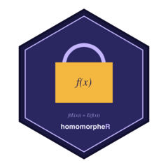

# homomorpheR 

<!-- badges: start -->
[](https://github.com/bnaras/homomorpheR/actions/workflows/R-CMD-check.yaml)
[](https://cran.r-project.org/package=homomorpheR)
<!-- badges: end -->

`homomorpheR` provides homomorphic computation in R for
privacy-preserving statistics. It implements the Paillier additive
scheme natively, and reaches the fully homomorphic CKKS, BFV, and BGV
schemes through the companion `openfhe.R` package. On top of these it
ships reusable master/worker primitives that let ordinary R modeling
code — `stats4::mle()`, stratified `survival::coxph()`, convex
programs via `CVXR` — run across sites that never share their raw
data, optionally under *n*-of-*n* threshold key generation so that no
single party can decrypt.

The published version may be found on
[CRAN](https://cran.r-project.org/package=homomorpheR) and can be
installed as usual.

## Development version

Install this development version by cutting and pasting into your R
session, which will install all dependencies also.

```
## Install a package if not already installed
install_if_needed <- function(packages, ...) {
    toInstall <- setdiff(packages, installed.packages()[, 1])
    if (length(toInstall) > 0) install.packages(toInstall, ...)
}
install_if_needed(c("gmp", "sodium", "devtools"), repos = "https://cloud.r-project.org")
devtools::install_github("bnaras/homomorpheR")
```

The fully homomorphic (CKKS/BFV/BGV) vignettes additionally require the
`openfhe.R` package.

The vignettes build up from a gentle introduction to complete
distributed protocols:

**Getting started**

- `introduction` — a quick tour of homomorphic computation in R.
- `mle` — homomorphic maximum-likelihood estimation for a Poisson
  parameter.

**Distributed statistical modeling under FHE**

- `cox` — stratified Cox regression distributed across sites under CKKS.
- `cox-threshold` — the same fit under *n*-of-*n* threshold key
  generation, so no single party can decrypt.
- `cvxr-consensus-admm` — consensus ADMM for a `CVXR` convex program
  under threshold FHE.
- `secure-inference` — two-party encrypted prediction.
- `encrypted-regression` — logistic regression on encrypted data via a
  Chebyshev sigmoid approximation.
- `similarity` — federated cosine-similarity retrieval with site-private
  fine-tuned models.
- `privacy-preserving-aggregation` — exact integer aggregation under BFV.

**Differential-privacy variants**

- `cox-threshold-dp`, `cvxr-consensus-admm-dp` — the threshold-FHE
  protocols above with site-side differential-privacy noise.

**Legacy Paillier vignettes** (the historical predecessors)

- `homomorphing` — Paillier homomorphic computations.
- `DHCox` — distributed Cox regression via Paillier.
- `QueryNCP` — query count with non-cooperating parties.
- `DHCoxNCP` — distributed Cox with non-cooperating parties.

A related project is [distcomp](https://cran.r-project.org/package=distcomp).

## Website

You can view everything, including documentation and vignettes on the
[homomorpheR website](https://bnaras.github.io/homomorpheR/). 
