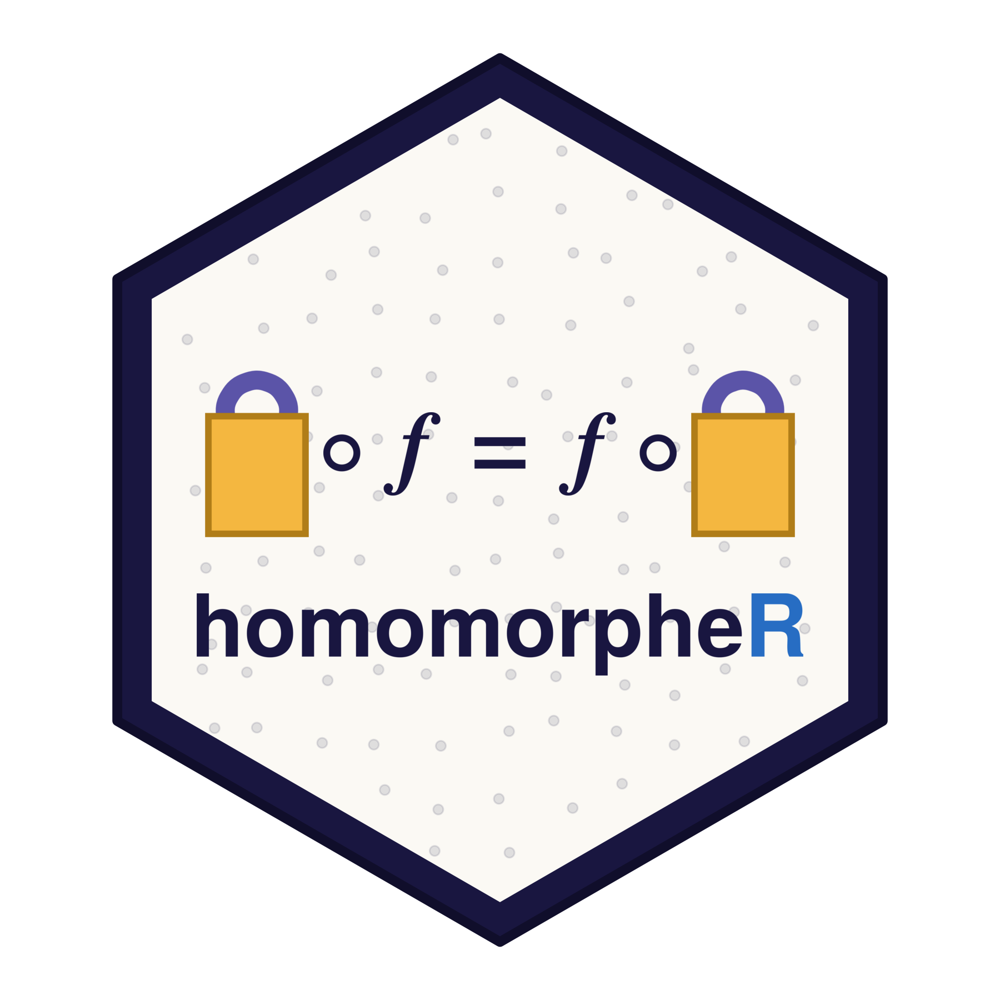

# homomorpheR 

<!-- badges: start -->
[](https://github.com/bnaras/homomorpheR/actions/workflows/R-CMD-check.yaml)
[](https://cran.r-project.org/package=homomorpheR)
<!-- badges: end -->

`homomorpheR` is privacy-preserving statistics across sites that never
share their data. It uses fully homomorphic encryption through the
`openfhe.R` interface to OpenFHE — CKKS for real-valued arithmetic,
BFV and BGV for exact integers — with *n*-of-*n* threshold key
generation so that no single party can decrypt. On top of these it
ships master/worker primitives that let ordinary R modeling code —
`stats4::mle()`, stratified `survival::coxph()`, convex programs via
`CVXR` — run across sites. A frozen implementation of the Paillier
additive scheme is kept for backward compatibility.

The version on [CRAN](https://cran.r-project.org/package=homomorpheR)
is 0.3, the Paillier-only release; this development version is a
rewrite on OpenFHE. Install it, with its dependencies, by

```r
remotes::install_github("bnaras/homomorpheR", ref = "v1.0")
```

The `cox` and `cvxr` vignettes also use `survival` and `CVXR`, which
are suggested rather than imported:

```r
install.packages(c("survival", "CVXR"))
```

The vignettes build up from a gentle introduction to complete
distributed protocols:

**Getting started**

- `introduction` — a quick tour of homomorphic computation in R.
- `precision` — which encrypted computations are exact and which are
  approximate.
- `privacy-preserving-aggregation` — exact integer aggregation under BFV.
- `query-count-threshold` — a count across sites under threshold keys.
- `mle` — homomorphic maximum-likelihood estimation for a Poisson
  parameter.

**Distributed statistical modeling under FHE**

- `cox` — stratified Cox regression distributed across sites under CKKS.
- `cox-threshold` — the same fit under *n*-of-*n* threshold key
  generation, so no single party can decrypt.
- `cvxr-cox-lasso-dlbcl` — a Cox-lasso fit by consensus ADMM, with
  `CVXR` at each site, under threshold FHE on the DLBCL
  gene-expression data.
- `secure-inference` — two-party encrypted prediction.
- `encrypted-regression` — logistic regression on encrypted data via a
  Chebyshev sigmoid approximation.
- `similarity` — federated cosine-similarity retrieval with site-private
  fine-tuned models.

**Gaussian-noise variants**

- `cox-threshold-dp`, `cvxr-consensus-admm-dp` — the threshold-FHE
  protocols above with site-side Gaussian noise. Demonstrations, not a
  privacy guarantee.

**Legacy Paillier vignettes.** These no longer ship with the package.
They are kept in the `paillier-archive/` directory of this repository.

- `homomorphing` — Paillier homomorphic computations.
- `DHCox` — distributed Cox regression via Paillier.
- `QueryNCP` — query count with non-cooperating parties.
- `DHCoxNCP` — distributed Cox with non-cooperating parties.

A related project is [distcomp](https://cran.r-project.org/package=distcomp).

## Website

You can view everything, including documentation and vignettes on the
[homomorpheR website](https://bnaras.github.io/homomorpheR/). 
