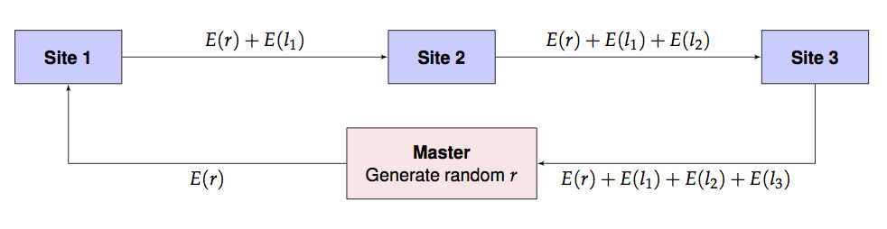

# Distributed Stratified Cox Regression using Homomorphic Computation

### Introduction

It is only a short way from the toy MLE example to a more useful example
using Cox regression.

But first, we need the `survival` package and the `homomopheR` package.

``` r

if (!require("survival")) {
    stop("this vignette requires the survival package")
}
library(homomorpheR)
```

We generate some simulated data for the purpose of this example. We will
have three sites each with patient data (sizes 1000, 500 and 1500)
respectively, containing

- `sex` (0, 1) for male/female
- `age` between 40 and 70
- a biomarker `bm`
- a `time` to some event of interest
- an indicator `event` which is 1 if an event was observed and 0
  otherwise.

It is common to fit stratified models using sites as strata since the
patient characteristics usually differ from site to site. So the
baseline hazards (`lambdaT`) are different for each site but they share
common coefficients (`beta.1`, `beta.2` and `beta.3` for `age`, `sex`
and `bm` respy.) for the model. See (Terry M. Therneau and Patricia M.
Grambsch 2000) by Therneau and Grambsch for details. So our model for
each site $`i`$ is

``` math
S(t, age, sex, bm) =
[S_0^i(t)]^{\exp(\beta_1 age + \beta_2 sex + \beta_3 bm)}
```

``` r

sampleSize <- c(n1 = 1000, n2 = 500, n3 = 1500)

set.seed(12345)

beta.1 <- -.015; beta.2 <- .2; beta.3 <- .001;

lambdaT <- c(5, 4, 3)
lambdaC <- 2

coxData <- lapply(seq_along(sampleSize),
                  function(i) {
                      sex <- sample(c(0, 1), size = sampleSize[i], replace = TRUE)
                      age <- sample(40:70, size = sampleSize[i], replace = TRUE)
                      bm <- rnorm(sampleSize[i])
                      trueTime <- rweibull(sampleSize[i],
                                           shape = 1,
                                           scale = lambdaT[i] * exp(beta.1 * age + beta.2 * sex + beta.3 * bm ))
                      censoringTime <- rweibull(sampleSize[i],
                                                shape = 1,
                                                scale = lambdaC)
                      time <- pmin(trueTime, censoringTime)
                      event <- (time == trueTime)
                      data.frame(stratum = i,
                                 sex = sex,
                                 age = age,
                                 bm = bm,
                                 time = time,
                                 event = event)
                  })
```

So here is a summary of the data for the three sites.

#### Site 1

``` r

str(coxData[[1]])
```

    ## 'data.frame':    1000 obs. of  6 variables:
    ##  $ stratum: int  1 1 1 1 1 1 1 1 1 1 ...
    ##  $ sex    : num  1 0 1 1 1 1 1 0 0 1 ...
    ##  $ age    : int  47 69 70 47 41 51 59 45 43 69 ...
    ##  $ bm     : num  -0.516 -1.375 1.01 0.454 0.275 ...
    ##  $ time   : num  1.37 0.95 2.35 2.48 1.93 ...
    ##  $ event  : logi  FALSE TRUE TRUE TRUE FALSE FALSE ...

#### Site 2

``` r

str(coxData[[2]])
```

    ## 'data.frame':    500 obs. of  6 variables:
    ##  $ stratum: int  2 2 2 2 2 2 2 2 2 2 ...
    ##  $ sex    : num  0 1 0 1 1 1 0 1 1 1 ...
    ##  $ age    : int  54 63 53 70 40 57 48 54 63 47 ...
    ##  $ bm     : num  -0.3243 0.2531 0.0464 0.8149 -0.1921 ...
    ##  $ time   : num  1.10483 0.34804 0.01602 0.68249 0.00157 ...
    ##  $ event  : logi  FALSE FALSE TRUE TRUE FALSE TRUE ...

#### Site 3

``` r

str(coxData[[3]])
```

    ## 'data.frame':    1500 obs. of  6 variables:
    ##  $ stratum: int  3 3 3 3 3 3 3 3 3 3 ...
    ##  $ sex    : num  1 0 0 1 1 1 0 1 0 1 ...
    ##  $ age    : int  55 70 49 60 44 42 58 62 61 68 ...
    ##  $ bm     : num  -0.9554 0.8138 0.0425 -1.2272 0.3244 ...
    ##  $ time   : num  0.0733 1.9869 2.2946 0.1231 1.0602 ...
    ##  $ event  : logi  TRUE FALSE FALSE TRUE FALSE FALSE ...

## 

## Aggregated fit

If the data were all aggregated in one place, it would very simple to
fit the model. Below, we row-bind the data from the three sites.

``` r

aggModel <- coxph(formula = Surv(time, event) ~ sex +
                                age + bm + strata(stratum),
                            data = do.call(rbind, coxData))
aggModel
```

    ## Call:
    ## coxph(formula = Surv(time, event) ~ sex + age + bm + strata(stratum), 
    ##     data = do.call(rbind, coxData))
    ## 
    ##          coef exp(coef)  se(coef)      z       p
    ## sex -0.160493  0.851723  0.050627 -3.170 0.00152
    ## age  0.010057  1.010108  0.002835  3.547 0.00039
    ## bm  -0.005989  0.994029  0.025208 -0.238 0.81222
    ## 
    ## Likelihood ratio test=22.82  on 3 df, p=4.413e-05
    ## n= 3000, number of events= 1575

Here `age` and `sex` are significant, but `bm` is not. The estimates
$`\hat{\beta}`$ are `(-0.180, .020, .007)`.

We can also print out the value of the (partial) log-likelihood at the
MLE.

``` r

aggModel$loglik
```

    ## [1] -9534.495 -9523.087

The first is the value at the parameter value `(0, 0, 0)` and the last
is the value at the MLE.

### Distributed Computation

Assume now that the data `coxData` is distributed between three sites
none of whom want to share actual data among each other or even with a
master computation process. They wish to keep their data secret but are
willing, together, to provide the sum of their local negative
log-likelihoods. They need to do this in a way so that the master
process will not be able to associate the contribution to the likelihood
from each site.

The overall likelihood function $`l(\lambda)`$ for the entire data is
therefore the sum of the likelihoods at each site: $`l(\lambda) =
l_1(\lambda)+l_2(\lambda)+l_3(\lambda).`$ How can this likelihood be
computed while maintaining privacy?

Assuming that every site including the master has access to a
homomorphic computation library such as `homomorpheR`, the likelihood
can be computed in a privacy-preserving manner using the following
scheme. We use $`E(x)`$ and $`D(x)`$ to denote the encrypted and
decrypted values of $`x`$ respectively.

0.  Master generates a public/private key pair. Master distributes the
    public key to all sites. (The private key is not distributed and
    kept only by the master.)
1.  Master generates a random offset $`r`$ to obfuscate the intial
    likelihood.
2.  Master sends $`E(r)`$ and a guess $`\lambda_0`$ to site 1. Note that
    $`\lambda`$ is not encrypted.
3.  Site 1 computes $`l_1 = l(\lambda_0, y_1)`$, the local likelihood
    for local data $`y_1`$ using parameter $`\lambda_0`$. It then sends
    on $`\lambda_0`$ and $`E(r) + E(l_1)`$ to site 2.
4.  Site 2 computes $`l_2 = l(\lambda_0, y_2)`$, the local likelihood
    for local data $`y_2`$ using parameter $`\lambda_0`$. It then sends
    on $`\lambda_0`$ and $`E(r) + E(l_1) + E(l_2)`$ to site 3.
5.  Site 3 computes $`l_3 = l(\lambda_0, y_3)`$, the local likelihood
    for local data $`y_3`$ using parameter $`\lambda_0`$. It then sends
    on $`E(r) + E(l_1) + E(l_2) + E(l_3)`$ back to master.
6.  Master retrieves $`E(r) + E(l_1) + E(l_2) + E(l_3)`$ which, due to
    the homomorphism, is exactly $`E(r+l_1+l_2+l_3) = E(r+l).`$ So the
    master computes $`D(E(r+l)) - r`$ to obtain the value of the overall
    likelihood at $`\lambda_0`$.
7.  Master updates $`\lambda_0`$ with a new guess $`\lambda_1`$ and
    repeats steps 1-5. This process is iterated to convergence. For
    added security, even steps 0-5 can be repeated, at additional
    computational cost.

This is pictorially shown below.



Round Robin Scheme

### Implementation

The above implementation assumes that the encryption and decryption can
happen with real numbers which is not the actual situation. Instead, we
use rational approximations using a large denominator, $`2^{256}`$, say.
In the future, of course, we need to build an actual library is built
with rigorous algorithms guaranteeing precision and overflow/undeflow
detection. For now, this is just an ad hoc implementation.

Also, since we are only using homomorphic additive properties, a partial
homomorphic scheme such as the Paillier Encryption system will be
sufficient for our computations.

We define a class to encapsulate our sites that will compute the Poisson
likelihood on site data given a parameter $`\lambda`$. Note how the
`addNLLAndForward` method takes care to split the result into an integer
and fractional part while performing the arithmetic operations. (The
latter is approximated by a rational number.)

We define a class to encapsulate our sites that will compute the partial
log likelihood on site data given a parameter $`\beta`$.

In the code below, we exploit, for expository purposes, a feature of
`coxph`: a control parameter can be passed to evaluate the partial
likelihood at a given $`\beta`$ value.

As in the MLE vignette, we hand the per-site negative log-likelihood
function to the exported
[`make_site()`](https://bnaras.github.io/homomorpheR/reference/make_site.md)
constructor and let
[`run_round_robin()`](https://bnaras.github.io/homomorpheR/reference/run_round_robin.md)
drive the protocol. The Cox-specific bit is the local function: at a
given $`\beta`$, run `coxph` with `iter.max = 0` (so it evaluates the
partial log-likelihood at exactly $`\beta`$ without iterating) and
return `-loglik[1]`. Wrap in `tryCatch` so that extreme $`\beta`$ values
that break the local solve return `NA`, which the runner propagates back
to [`mle()`](https://rdrr.io/r/stats4/mle.html) as `NA_real_`.

``` r

library(homomorpheR)

cph_control <- replace(coxph.control(), "iter.max", 0)

local_nll <- function(data, beta) {
    tryCatch({
        m <- coxph(formula = Surv(time, event) ~ sex + age + bm,
                   data    = data,
                   init    = beta,
                   control = cph_control)
        -(m$loglik[1])
    }, error = function(e) NA)
}
```

#### 1. Generate a key pair

``` r

keys <- paillier_keypair(modulus_bits = 1024)
```

#### 2. Build sites and master, wire the chain

``` r

site1  <- make_site("Site 1", data = coxData[[1]], local_fn = local_nll)
site2  <- make_site("Site 2", data = coxData[[2]], local_fn = local_nll)
site3  <- make_site("Site 3", data = coxData[[3]], local_fn = local_nll)
master <- make_master("Master", keypair = keys)
round_robin_chain(master, list(site1, site2, site3))
```

#### 3. Perform the likelihood estimation

``` r

library(stats4)
nll <- function(age, sex, bm) run_round_robin(master, c(age, sex, bm))
fit <- mle(nll, start = list(age = 0, sex = 0, bm = 0))
```

#### 5. Compare the results

The summary will show the results.

``` r

summary(fit)
```

    ## Maximum likelihood estimation
    ## 
    ## Call:
    ## mle(minuslogl = nll, start = list(age = 0, sex = 0, bm = 0))
    ## 
    ## Coefficients:
    ##         Estimate  Std. Error
    ## age -0.160493329 0.050626613
    ## sex  0.010057265 0.002835374
    ## bm  -0.005988214 0.025208371
    ## 
    ## -2 log L: 19046.17

Note how the estimated coefficients and standard errors closely match
the full model summary below.

``` r

summary(aggModel)
```

    ## Call:
    ## coxph(formula = Surv(time, event) ~ sex + age + bm + strata(stratum), 
    ##     data = do.call(rbind, coxData))
    ## 
    ##   n= 3000, number of events= 1575 
    ## 
    ##          coef exp(coef)  se(coef)      z Pr(>|z|)    
    ## sex -0.160493  0.851723  0.050627 -3.170  0.00152 ** 
    ## age  0.010057  1.010108  0.002835  3.547  0.00039 ***
    ## bm  -0.005989  0.994029  0.025208 -0.238  0.81222    
    ## ---
    ## Signif. codes:  0 '***' 0.001 '**' 0.01 '*' 0.05 '.' 0.1 ' ' 1
    ## 
    ##     exp(coef) exp(-coef) lower .95 upper .95
    ## sex    0.8517      1.174    0.7713    0.9406
    ## age    1.0101      0.990    1.0045    1.0157
    ## bm     0.9940      1.006    0.9461    1.0444
    ## 
    ## Concordance= 0.536  (se = 0.009 )
    ## Likelihood ratio test= 22.82  on 3 df,   p=4e-05
    ## Wald test            = 22.81  on 3 df,   p=4e-05
    ## Score (logrank) test = 22.85  on 3 df,   p=4e-05

And the log likelihood of the distributed homomorphic fit also matches
that of the model on aggregated data:

``` r

cat(sprintf("logLik(MLE fit): %f, logLik(Agg. fit): %f.\n", logLik(fit), aggModel$loglik[2]))
```

    ## logLik(MLE fit): -9523.087001, logLik(Agg. fit): -9523.087001.

### References

Terry M. Therneau, and Patricia M. Grambsch. 2000. *Modeling Survival
Data: Extending the Cox Model*. Springer-Verlag.
