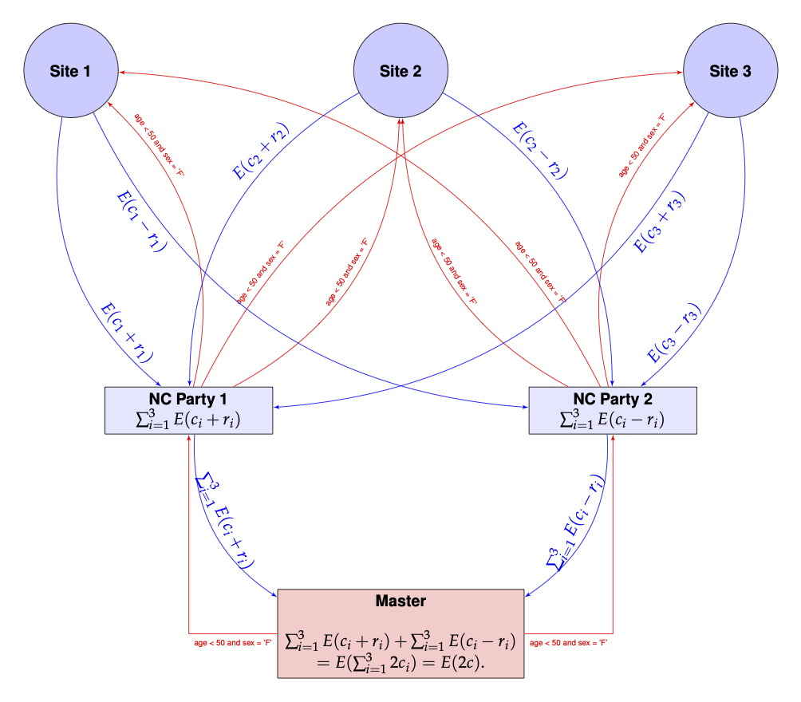

# Distributed Query Count using Non-Cooperating Parties

## Introduction

We demonstrate the use of non-cooperating parties to run a distributed
query count computation using the `homomorpheR` package a simulated data
set containing:

- `sex` (F, M) for female/male
- `age` between 40 and 70
- `bm` a biomarker

``` r

set.seed(130)
sample_size  <- c(60, 15, 25)
query_data  <- local({
    tmp  <- c(0, cumsum(sample_size))
    start  <- tmp[1:3] + 1
    end  <- tmp[-1]
    id_list  <- Map(seq, from = start, to = end)
    lapply(seq_along(sample_size),
           function(i) {
               id  <- sprintf("P%4d", id_list[[i]])
               sex <- sample(c("F", "M"), size = sample_size[i], replace = TRUE)
               age <- sample(40:70, size = sample_size[i], replace = TRUE)
               bm <- rnorm(sample_size[i])
               data.frame(id = id, sex = sex, age = age, bm = bm, stringsAsFactors = FALSE)
           })
})
```

### Site 1

``` r

str(query_data[[1]])
```

    ## 'data.frame':    60 obs. of  4 variables:
    ##  $ id : chr  "P   1" "P   2" "P   3" "P   4" ...
    ##  $ sex: chr  "F" "F" "F" "M" ...
    ##  $ age: int  43 67 66 59 63 52 55 46 43 60 ...
    ##  $ bm : num  1.252 -1.01 0.551 -0.379 0.284 ...

### Site 2

``` r

str(query_data[[2]])
```

    ## 'data.frame':    15 obs. of  4 variables:
    ##  $ id : chr  "P  61" "P  62" "P  63" "P  64" ...
    ##  $ sex: chr  "M" "F" "M" "F" ...
    ##  $ age: int  53 64 45 61 55 65 65 51 53 47 ...
    ##  $ bm : num  0.698 -0.447 -0.224 1.086 1.188 ...

### Site 3

``` r

str(query_data[[3]])
```

    ## 'data.frame':    25 obs. of  4 variables:
    ##  $ id : chr  "P  76" "P  77" "P  78" "P  79" ...
    ##  $ sex: chr  "M" "M" "M" "M" ...
    ##  $ age: int  69 70 41 63 42 57 43 55 68 46 ...
    ##  $ bm : num  -1.682 1.363 1.273 -0.68 0.625 ...

## Aggregated Query

If the data were all aggregated in one place, it would very simple to
query it. Let us run a sample query on this aggregated data set for the
condition `age < 50 & sex == 'F' & bm < 0.2`

``` r

nrow(subset(do.call(rbind, query_data),
            age < 50 & sex == "F" & bm < 0.2))
```

    ## [1] 11

## Distributed Computation

Assume now that the data `query_data` is distributed between three sites
none of whom want to share actual data among each other or even with a
master computation process. They wish to keep their data secret but are
willing, together, to provide the sum of the total count. They wish to
do this in a manner so that the master process is *unable to associate
the contribution to the likelihood from each site*.

The overall query count for for the entire data is the sum of the counts
at each site. How can this count be computed while preventing the master
from knowing the individual contributions of each site?

We will use two *non-cooperating parties*, say NCP1 and NCP2, to
accomplish this. These parties do not talk to each other, but do talk to
the sites and the master process. Site $`i`$ sends $`E(c_i + r_i)`$ to
NCP1 and $`E(c_i - r_i)`$ to NCP2, where $`c_i`$ is the actual count,
$`E(c_i)`$ denotes the encrypted value of $`c_i`$ and $`r_i`$ is a
random quantity generated anew for each site. NCP1 can compute
$`\sum_{i=1}^3E(c_i + r_i)`$ and NCP2 can compute $`\sum_{i=1}^3E(c_i -
r_i)`$, but individually, neither has a handle on $`l = \sum_{i=1}^3
c_i`$.

The *master* process can retrieve $`\sum_{i=1}^3E(c_i + r_i)`$ and
$`\sum_{i=1}^3E(c_i - r_i)`$ from NCP1 and NCP2 respectively. Each is an
encrypted value of the sum of counts from all sites, obfuscated by
random terms, and hence is random to the master. However, the master
using the associative and homomorphic properties of $`E(.)`$, can
compute:

``` math
\sum_{i=1}^3E(c_i + r_i) +\sum_{i=1}^3E(c_i - r_i) = \sum_{i=1}^3E(c_i
+ r_i + c_i - r_i)  = \sum_{i=1}^3E(2c_i)  = E(2c)
```

since $`c = c_1 + c_2 + c_3`$ is the grant total count. The master can
now decrypt the result and obtain $`c`$!

This is pictorially shown below.


Communication topology in which the master talks directly to each site
and to both non-cooperating parties: every site sends its encrypted
count obfuscated as E(c_i + r_i) to NCP1 and as E(c_i - r_i) to NCP2,
and the master retrieves the two encrypted sums and adds them to recover
E(2c).

The red arrows show the master proposing a value $`\beta`$ to each of
the sites, which reply back to NCP1 and NCP2. The master then retrieves
the values from NCP1 and NCP2 and sums them.

### A Modified Topology

The drawback of the above scheme is that channels of communication have
to be established from each site to the master process and also to the
two non-cooperating parties NCP1 and NCP2. If the number of
participating sites in a computation changes, then both the master and
NCP1 and NCP2 have to be made aware of the change.

It would be simpler if only NCP1 and NCP2 can talk to both the master
and the sites. Such a situation would arise, for example, when the sites
are all participating in a disease specific registry. The parties NCP1
and NCP2 would probably be set up once and any new site that has to be
onboarded needs only to be known to P1 and P2. This has the added
advantage of hiding the number of sites, which could even be 1!

Such a communication topology would mean that the $`\beta`$ values have
be funneled to the sites through NCP1 and NCP2 and that can be easily
accomplished. The picture below shows this configuration and looks more
complicated than it actually is.



To summarize, the modified scheme has several characteristics:

- The master only communicates with NCP1 and NCP2
- NCP1 and NCP2 are the only parties communicating with both the master
  and sites
- NCP1 and NCP2 are the only ones that know how many sites are
  participating
- New sites can be added and only NCP1 and NCP2 need to account for them
  while the master remains oblivous to the number of sites; so *the
  scheme works even with one site*
- It appears that there is unnecessary communication of the same
  information, i.e. $`\beta`$ is being sent twice to each site from each
  of the NCP1 and NCP2. This is easily mitigated by engineering either
  by using a broker between NCP1 and NCP2, or the sites caching their
  results for a short period to avoid recomputation.

## Implementation

The above implementation assumes that the encryption and decryption can
happen with real numbers which is not the actual situation. Instead, we
use rational approximations using a large denominator, $`2^{256}`$, say.
In the future, of course, we need to build an actual library is built
with rigorous algorithms guaranteeing precision and overflow/undeflow
detection. For now, this is just an ad hoc implementation.

Also, since we are only using homomorphic additive properties, a partial
homomorphic scheme such as the Paillier Encryption system will be
sufficient for our computations.

We define classes to encapsulate our sites, non-cooperating parties and
a master process.

### The Site Class

Our site class will compute the count on site data.

``` r

library(S7)

Site <- new_class("Site",
    properties = list(
        name  = class_character,
        data  = class_any,
        state = class_any
    ),
    constructor = function(name, data) {
        new_object(
            S7_object(),
            name  = name,
            data  = data,
            state = new.env(parent = emptyenv())
        )
    }
)

set_public_key       <- new_generic("set_public_key",       "obj")
set_filter_condition <- new_generic("set_filter_condition", "obj")
query_count          <- new_generic("query_count",          "obj")

method(set_public_key, Site) <- function(obj, pubkey) {
    obj@state$pubkey <- pubkey; invisible(obj)
}
method(set_filter_condition, Site) <- function(obj, filter_condition) {
    obj@state$filter_condition <- filter_condition; invisible(obj)
}

method(query_count, Site) <- function(obj, party) {
    ## Cache the split-and-encrypted local count under the site's
    ## current filter condition; both NCPs see the same site, but each
    ## gets a different additive share.
    if (is.null(obj@state$result_cache)) {
        pubkey      <- obj@state$pubkey
        offset_int  <- random.bigz(nBits = 256)
        filter_expr <- parse(text = obj@state$filter_condition)[[1]]
        result_int  <- nrow(obj@data[eval(filter_expr, obj@data, parent.frame()), ,
                                     drop = FALSE])
        obj@state$result_cache <- list(
            int1 = encrypt(pubkey, result_int - offset_int),
            int2 = encrypt(pubkey, result_int + offset_int)
        )
    }
    if (party == 1) obj@state$result_cache$int1 else obj@state$result_cache$int2
}
```

### The Non-cooperating Parties Class

The non-cooperating parties can communicate with the sites. So they have
methods for adding sites, passing on public keys from the master etc.
The `query_count` method for this class merely calls each site to
compute the result and adds them up before sending it on to the master,
so that the master has no idea of the individual contributions.

``` r

NCParty <- new_class("NCParty",
    properties = list(
        name   = class_character,
        number = class_integer,
        state  = class_any
    ),
    constructor = function(name, number) {
        new_object(
            S7_object(),
            name   = name,
            number = as.integer(number),
            state  = new.env(parent = emptyenv())
        )
    }
)

add_site <- new_generic("add_site", "ncp")

method(set_public_key, NCParty) <- function(obj, pubkey) {
    obj@state$pubkey <- pubkey
    for (s in obj@state$sites %||% list()) set_public_key(s, pubkey)
    invisible(obj)
}
method(set_filter_condition, NCParty) <- function(obj, filter_condition) {
    obj@state$filter_condition <- filter_condition
    for (s in obj@state$sites %||% list()) set_filter_condition(s, filter_condition)
    invisible(obj)
}
method(add_site, NCParty) <- function(ncp, site) {
    ncp@state$sites <- c(ncp@state$sites %||% list(), list(site))
    invisible(ncp)
}

method(query_count, NCParty) <- function(obj) {
    pubkey  <- obj@state$pubkey
    sites   <- obj@state$sites
    results <- lapply(sites, query_count, party = obj@number)
    Reduce(`+`, results, init = encrypt(pubkey, 0L))
}

`%||%` <- function(a, b) if (is.null(a)) b else a
```

### The Master Class

The master process generates the keys, broadcasts the public key through
both non-cooperating parties to all sites, and decrypts the combined
result.

``` r

Master <- new_class("Master",
    properties = list(
        name             = class_character,
        filter_condition = class_character,
        state            = class_any
    ),
    constructor = function(name, filter_condition) {
        new_object(
            S7_object(),
            name             = name,
            filter_condition = filter_condition,
            state            = new.env(parent = emptyenv())
        )
    }
)

set_ncparty_1 <- new_generic("set_ncparty_1", "master")
set_ncparty_2 <- new_generic("set_ncparty_2", "master")

method(set_ncparty_1, Master) <- function(master, ncp) {
    master@state$nc_party_1 <- ncp
    set_public_key(ncp, master@state$keys@pubkey)
    set_filter_condition(ncp, master@filter_condition)
    invisible(master)
}
method(set_ncparty_2, Master) <- function(master, ncp) {
    master@state$nc_party_2 <- ncp
    set_public_key(ncp, master@state$keys@pubkey)
    set_filter_condition(ncp, master@filter_condition)
    invisible(master)
}

method(query_count, Master) <- function(obj) {
    if (is.null(obj@state$keys))
        obj@state$keys <- paillier_keypair(1024)
    privkey <- get_private_key(obj@state$keys)
    result1 <- query_count(obj@state$nc_party_1)
    result2 <- query_count(obj@state$nc_party_2)
    enc_sum <- result1 + result2
    final   <- as.integer(decrypt(privkey, enc_sum))
    final / 2
}
```

## Example

We are now ready to use our sites in the computation.

### 1. Create sites

``` r

site1 <- Site(name = "Site 1", data = query_data[[1]])
site2 <- Site(name = "Site 2", data = query_data[[2]])
site3 <- Site(name = "Site 3", data = query_data[[3]])

sites <- list(site1 = site1, site2 = site2, site3 = site3)
```

### 2. Create Non-cooperating parties

``` r

ncp1 <- NCParty("NCP1", 1)
ncp2 <- NCParty("NCP2", 2)
```

We add sites to the non-cooperating parties.

``` r

for (s in sites) {
    add_site(ncp1, s)
    add_site(ncp2, s)
}
```

### 3. Create the master process

``` r

master <- Master(name = "Master",
                 filter_condition = "age < 50 & sex == 'F' & bm < 0.2")
master@state$keys <- paillier_keypair(1024)
```

We next connect the master to the non-cooperating parties.

``` r

set_ncparty_1(master, ncp1)
set_ncparty_2(master, ncp2)
```

At this point the communication graph has been defined between the
master and non-cooperating parties and the non-cooperating parties and
the sites.

### 4. Perform the Query

``` r

cat(sprintf("Query Count is %d\n", query_count(master)))
```

    ## Query Count is 11

## References
