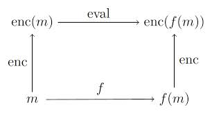

# Introduction to Homomorphic Computation in R

## Introduction

A homomorphism is a structure-preserving map from one algebraic
structure to another; see
[Wikipedia](https://en.wikipedia.org/wiki/Homomorphism). Privacy experts
are interested in homomorphic computation because it offers a way to
perform computations on encrypted data, either in a distributed setting
or in the cloud, thereby handling many of the headaches associated with
storing/moving/anonymizing data. Homomorphic computation also finds
application in secure voting, verifyable computing, secure multi-party
computation, etc.

A homomorphic encryption scheme is one that provides such a homomorphism
along with the infrastructure to carry out the computations. The schemes
provide algorithms for generating public and private keys. The public
key is distributed to anyone and the private key is only needed by the
one who does the decryption. There are several such schemes documented
in [Wikipedia](https://en.wikipedia.org/wiki/Homomorphic_encryption).
The main thing to know is that there are two flavours: partial and full.
Partial schemes preserve structure for certain specified operations, say
addition only, whereas full schemes do over all the standard arithmetic
operations. The operations mentioned here are all in the context of the
algebraic structure underneath, which for our purposes will be modular
arithmetic where the modulus is some large number.

The current package `homomorpheR` implements the Paillier system which
is a partially homomorphic; it provides an additive homomorphism. The
implementation here borrows much from the Javascript implementation for
a proof-of-concept system. Therefore, it is not yet ready for serious
work. So there, you’ve been warned.

If you are interested in the mathematical details of the Paillier
crytosystem, the main reference is (Paillier 1999). Volkhausen (2006)
provides a detailed mathematical introduction; Michael O’Keefe (2008) is
a gentler one. A simple application of the Paillier system for secure
vote tallying is in (Choinyammbu 2009).

A bit of notation helps. Let $`x`$ be any message; for us, it is just a
large integer. Denote $`E(x)`$ as the encrypted message and $`D(x)`$ as
the decryption of $`x`$ in some scheme. If the scheme is homomorphic
over addition, then we have
``` math
 E(x) + E(y) = E(x + y). 
```

This means that calculating $`x+y`$ can be done by decrypting the sum of
the encrypted values of $`x`$ and $`y`$. Thus, entities need exchange
only encrypted values throughout. This is pictorially shown in the
figure (source: Jeremy Kun) below:



Homomorphic Computation

## Facilities

As a first step, a public and private key pair needs to be generated. In
generating bits for cryptosystems, a secure random number source is
needed; `homomorpheR` makes use of the R package `sodium` by Jeroen Ooms
(based on Daniel J. Bernstein’s generators) in addition to `gmp` for
arbitrary precision arithmetic.

``` r

library(homomorpheR)
keyPair <- paillier_keypair(modulus_bits = 1024)
```

Examine the `keyPair` object:

``` r

keyPair
```

    ## <PaillierKeyPair>
    ##   bits: 1024

The `pubkey` slot can be distributed to all interested parties, but the
private key, obtainable via
[`get_private_key()`](https://bnaras.github.io/homomorpheR/reference/get_private_key.md),
should be kept secret for decryption.

The main generics are
[`encrypt()`](https://bnaras.github.io/homomorpheR/reference/encrypt.md)
for the public key and
[`decrypt()`](https://bnaras.github.io/homomorpheR/reference/decrypt.md)
for the private key. Encrypted values are wrapped in
`PaillierCiphertext` objects so that R’s `+`, `-`, and `*` operators
dispatch to the homomorphic operations directly.

## Some tests

We can now perform some simple tests. First a small helper that encrypts
and immediately decrypts:

``` r

encryptAndDecrypt <- function(x)
    decrypt(get_private_key(keyPair), encrypt(keyPair@pubkey, x))
```

Now we can encrypt and decrypt some numbers.

``` r

a <- gmp::as.bigz(1273849)
identical(a + 10, encryptAndDecrypt(a + 10))
```

    ## [1] TRUE

Now with a large set of numbers. The function `random.bigz` returns
large random numbers.

``` r

m <- lapply(1:100, function(x) random.bigz(nBits = 512))
md <- lapply(m, encryptAndDecrypt)
identical(m, md)
```

    ## [1] TRUE

We can also do arithmetic directly on encrypted values. The result
decrypts to the same value we would have obtained on the cleartext:

``` r

ct_a <- encrypt(keyPair@pubkey, gmp::as.bigz(123))
ct_b <- encrypt(keyPair@pubkey, gmp::as.bigz(456))
priv <- get_private_key(keyPair)
identical(gmp::as.bigz(123 + 456),     decrypt(priv, ct_a + ct_b))
```

    ## [1] TRUE

``` r

identical(gmp::as.bigz(123 - 456),     decrypt(priv, ct_a - ct_b))
```

    ## [1] FALSE

``` r

identical(gmp::as.bigz(123 * 5),       decrypt(priv, ct_a * gmp::as.bigz(5)))
```

    ## [1] TRUE

## References

Choinyammbu, Sansar. 2009. *Homomorphic Tallying with Paillier
Cryptosystem*.

O’Keefe, Michael. 2008. *The Paillier Cryptosystem: A Look into the
Cryptosystem and Its Potential Application*.

Paillier, Pascal. 1999. “Public-Key Cryptosystems Based on Composite
Degree Residuosity Classes.” *Advances in Cryptology - EUROCRYPT ’99,
International Conference on the Theory and Application of Cryptographic
Techniques, Prague, Czech Republic, May 2-6, 1999, Proceeding*, 223–38.
<https://doi.org/10.1007/3-540-48910-X_16>.

Volkhausen, Tobias. 2006. *Paillier Cryptosystem: A Mathematical
Introduction*.
