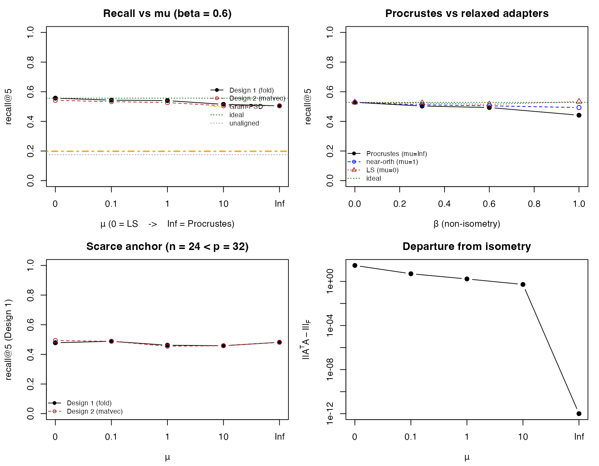

# Federated Cosine Similarity with Site-Private Fine-Tuned Models

## Introduction

A recurring problem in federated medical analytics is similarity search
across silos. A clinician at one hospital sees an unusual case and wants
to ask “do other hospitals in our network have similar patients?” —
without sending the patient out, without the other hospitals revealing
which of their patients were checked, and without any single party
(including a coordinating master) seeing similarity scores in the clear.

The natural primitive is cosine similarity between embeddings. Modern
foundation models map patient data (radiology reports, chest X-rays,
pathology slides) into a fixed-dimensional vector space where geometric
proximity tracks clinical similarity. Cosine similarity reduces to an
inner product on unit-norm vectors, which is exactly what threshold CKKS
computes efficiently.

The wrinkle is that hospitals do not all use the *same* model. Each
hospital starts from a public foundation model and fine-tunes it on its
own data for its own purposes — it does not constrain the result to be
an isometry of the public model. The fine-tuned embeddings therefore
differ from the public baseline by a generically *non-isometric*
transformation of the geometry, and a query in the public-model space is
no longer directly comparable to a database vector in a hospital’s
private space.

This vignette closes the gap with a per-site *compatibility adapter*
$`A_k`$, fit post hoc on a public anchor cohort. The adapter lives on a
one-parameter family indexed by a near-isometry penalty $`\mu`$:
orthogonal Procrustes at one end ($`\mu\to\infty`$), unconstrained least
squares at the other ($`\mu = 0`$), near-orthogonal maps in between. It
is deployed in either of two ways — applied to the encrypted query (the
homomorphic matrix–vector multiply, valid as a cosine near the
orthogonal end), or folded into the database offline so the encrypted
query reduces to a plain inner product. Threshold decryption returns the
top-`k` matches, with no party able to decrypt any intermediate value
unilaterally.

The accompanying `similarity-sideexp.md` document describes a deferred
experiment on a real fine-tuned model. The vignette uses synthetic data
so it renders quickly during package build.

## The setup

Three sites — labeled $`S_1, S_2, S_3`$ — each hold a cohort of
patients. Each cohort is embedded with the site’s privately fine-tuned
model into $`\mathbf{R}^p`$ for some fixed dimension $`p`$ (the
architecture is shared across sites; only the weights differ).

The query enters the system from a clinician who does not have access to
any site’s private model. They embed their candidate patient with the
*public* foundation model, producing $`q \in
\mathbf{R}^p`$. The query is encrypted under a joint threshold key whose
secret-key material is shared $`n`$-of-$`n`$ across the three sites.

The retrieval target is the top-$`k`$ patients across all sites whose
private-model embeddings are most cosine-similar to the query, returned
as a list of $`(\text{site\_id},
\text{local\_patient\_id}, \text{score})`$ tuples.

The friction is that $`q`$ lives in the public-model geometry while each
site’s database lives in the site’s private-model geometry. We close the
gap with a per-site *compatibility adapter* $`A_k`$ fit on a public
anchor cohort. $`A_k`$ is held privately by site $`k`$ and never leaves;
it is applied to encrypted queries to bring them into agreement with
site $`k`$’s geometry before the inner-product step (or, equivalently,
folded into the site’s database offline).

## Threat model

Three sites and one untrusted aggregator (the master):

- **Sites $`S_1, S_2, S_3`$** each hold private patient embeddings, a
  private compatibility adapter $`A_k`$, and a secret-key share
  $`\mathit{sk}_k`$. They are honest-but-curious among themselves and
  toward the master. Each site sees the master’s encrypted query but
  cannot decrypt it; each site sees its own database in the clear (it is
  its own data); each site never sees other sites’ databases or scores.
- **Master** holds no secret-key material. It receives the encrypted
  query from the querier, broadcasts it to the sites, collects their
  encrypted scores, orchestrates the n-of-n partial-decryption ceremony
  for the top-$`k`$ results, and returns them to the querier. A curious
  or compromised master cannot decrypt anything by itself.
- **Querier** sees only the top-$`k`$ result tuples. Repeated adaptive
  queries leak structural information about the database in the same
  Hyrum-style sense as any retrieval system; this leakage is
  acknowledged but not eliminated.

What the master sees, by stage:

1.  The encrypted query $`\mathit{ct}_q`$. Not decryptable alone.
2.  Per-site encrypted scores. Not decryptable alone.
3.  Partial decryptions of the top-$`k`$ scores from each site. Not
    decryptable individually.
4.  After fusion, the top-$`k`$ scores in the clear. Released to the
    querier as the protocol output.

Step 4 is the only cleartext the master ever holds, and only for the
top-$`k`$ scores released to the querier — not for any intermediate
quantity.

The site-private compatibility adapters $`\{A_k\}`$ never leave their
sites. Each is applied to an encrypted vector while it stays encrypted —
an unencrypted matrix times an encrypted vector — or else folded into
the site’s database offline, so the adapter never appears in the clear
at any party other than its owner.

## The protocol

The protocol has three phases. The setup phase runs once, offline; the
query phase and result phase run for each query.

**Setup phase.**

1.  The three sites jointly generate a CKKS threshold key pair
    ($`n`$-of-$`n`$). Joint rotation keys for slot rotations
    $`1, 2, \ldots, p-1`$ are also generated by an $`n`$-of-$`n`$
    ceremony.
2.  A public anchor cohort of patients with public-model embeddings is
    published.
3.  Each site embeds the anchor cohort with its private fine-tuned model
    and fits its $`p \times p`$ compatibility adapter $`A_k`$ along the
    $`\mu`$ family (orthogonal Procrustes at $`\mu\to\infty`$, least
    squares at $`\mu = 0`$).
4.  Each site stores its local cohort, embedded with the private model
    and normalized to unit length — and, for the fold (Design 1)
    deployment, the public-compatible images of those vectors.

**Query phase.** The querier embeds their candidate patient with the
public model, normalizes to unit length, encrypts into a single
slot-packed encrypted vector under the joint public key, and broadcasts
that to the master.

For each site $`k`$:

5.  The site receives the encrypted query $`\mathit{ct}_q`$.
6.  The site applies its private $`A_k`$ to the encrypted query via
    diagonal-encoded matrix–vector multiplication, producing
    $`\mathit{ct}_{A_k q}`$ (Design 2). Near the orthogonal end of the
    family the result is unit-norm, so the score is a genuine cosine;
    alternatively the site skips this step and scores the query directly
    against its folded public-compatible database (Design 1).
7.  The site computes inner products against each of its local
    embeddings $`v_{k,i}`$ via slot-wise multiplication followed by
    log-$`p`$ rotation-and-add slot summation, producing one encrypted
    scalar per local patient.
8.  The site returns its encrypted scores to the master, alongside its
    local patient indices in the clear.

**Result phase.**

9.  The master concatenates encrypted scores across all sites. In v1,
    local indices are kept in the clear alongside the encrypted scores;
    encrypted top-$`k`$ selection in CKKS is feasible but adds depth and
    complexity orthogonal to this vignette’s pedagogical aim.
10. The master collects partial decryption shares from all three sites
    for the encrypted scores. Fusion yields the scores in the clear; the
    master sorts them there and returns the top-$`k`$ to the querier.

## Synthetic data

The vignette uses fully synthetic data so it renders quickly during
package build. The phenotype-mixture model below is the simplest setup
that gives a meaningful retrieval ground truth.

[`suppressPackageStartupMessages`](https://rdrr.io/r/base/message.html)`(``{`` `` `[`library`](https://rdrr.io/r/base/library.html)`(`[`homomorpheR`](https://bnaras.github.io/homomorpheR/)`)`` `` `[`library`](https://rdrr.io/r/base/library.html)`(`[`openfhe.R`](https://openfheorg.github.io/openfhe.R/)`)`` ``}``)`` `[`set.seed`](https://rdrr.io/r/base/Random.html)`(``20260428``)`` `` ``p`` ``<-`` ``32L`` ``n_sites`` ``<-`` ``3L`` ``cohort_sizes`` ``<-`` `[`c`](https://rdrr.io/r/base/c.html)`(``80L``, ``60L``, ``100L``)`` ``n_anchor`` ``<-`` ``100L`` ``n_phenotypes`` ``<-`` ``5L`` ``top_k`` ``<-`` ``5L`

A patient is one of `n_phenotypes` clinical phenotypes. Each phenotype
is a Gaussian cluster in $`\mathbf{R}^p`$. Phenotype labels are the
retrieval ground truth: a query of phenotype $`j`$ should be matched to
database patients of phenotype $`j`$.

`phenotype_centers`` ``<-`` `[`matrix`](https://rdrr.io/r/base/matrix.html)`(`[`rnorm`](https://rdrr.io/r/stats/Normal.html)`(``n_phenotypes`` ``*`` ``p``, sd ``=`` ``1``)``,`` `` ``n_phenotypes``, ``p``)`` `` ``embed_public`` ``<-`` ``function``(``n``)`` ``{`` `` ``labels`` ``<-`` `[`sample.int`](https://rdrr.io/r/base/sample.html)`(``n_phenotypes``, ``n``, replace ``=`` ``TRUE``)`` `` ``centers`` ``<-`` ``phenotype_centers``[``labels``, , drop ``=`` ``FALSE``]`` `` ``noise`` ``<-`` `[`matrix`](https://rdrr.io/r/base/matrix.html)`(`[`rnorm`](https://rdrr.io/r/stats/Normal.html)`(``n`` ``*`` ``p``, sd ``=`` ``0.4``)``, ``n``, ``p``)`` `` ``z`` ``<-`` ``centers`` ``+`` ``noise`` `` ``z`` ``<-`` ``z`` ``/`` `[`sqrt`](https://rdrr.io/r/base/MathFun.html)`(`[`rowSums`](https://rdrr.io/r/base/colSums.html)`(``z``^``2``)``)`` ``# unit norm`` `` `[`list`](https://rdrr.io/r/base/list.html)`(``z ``=`` ``z``, label ``=`` ``labels``)`` ``}`

A site fine-tunes for its own purposes; it does not constrain the result
to be an isometry of the public model. We therefore model the per-site
drift as a *non-isometric* linear map $`B_k = Q_k D_k`$ — a random
rotation $`Q_k`$ composed with a diagonal stretch
$`D_k = \mathrm{diag}(e^{\beta g})`$, $`g`$ standard normal. The
parameter $`\beta`$ is the non-isometry magnitude: $`\beta = 0`$
recovers an exactly orthogonal drift (the special case where the
geometry is merely rotated), and $`\beta > 0`$ stretches the embedding
directions anisotropically, as a freely fine-tuned model generically
would. The site’s embeddings are unit-normalized after the map, so the
drift acts on the sphere.

`random_drift`` ``<-`` ``function``(``p``, ``beta``)`` ``{`` `` ``## Free fine-tuning, simulated as B = Q D: a random rotation Q`` `` ``## composed with an anisotropic stretch D = diag(exp(beta g)).`` `` ``## beta = 0 gives an exactly orthogonal (isometric) drift;`` `` ``## beta > 0 is non-isometric, the generic fine-tuned case.`` `` ``Q`` ``<-`` `[`qr.Q`](https://rdrr.io/r/base/qraux.html)`(`[`qr`](https://rdrr.io/r/base/qr.html)`(`[`matrix`](https://rdrr.io/r/base/matrix.html)`(`[`rnorm`](https://rdrr.io/r/stats/Normal.html)`(``p`` ``*`` ``p``)``, ``p``, ``p``)``)``)`` `` ``if`` ``(``beta`` ``==`` ``0``)`` `[`return`](https://rdrr.io/r/base/function.html)`(``Q``)`` `` ``Q`` `[`%*%`](https://rdrr.io/r/base/matmult.html)` `[`diag`](https://www.cvxgrp.org/CVXR/reference/math_atoms.html)`(`[`exp`](https://rdrr.io/r/base/Log.html)`(``beta`` ``*`` `[`rnorm`](https://rdrr.io/r/stats/Normal.html)`(``p``)``)``)`` ``}`` `` ``embed_private`` ``<-`` ``function``(``z_public``, ``B_k``)`` ``{`` `` ``## Site k's fine-tuned model in column-vector convention:`` `` ``## f_k(x) = B_k · f(x). For a matrix z_public of n row-stacked`` `` ``## vectors, the private embeddings are z_public %*% t(B_k),`` `` ``## then unit-normalized (the drift acts on the sphere; under a`` `` ``## non-isometric B the normalization is a genuine nonlinearity).`` `` ``v`` ``<-`` ``z_public`` `[`%*%`](https://rdrr.io/r/base/matmult.html)` `[`t`](https://rdrr.io/r/base/t.html)`(``B_k``)`` `` ``v`` ``/`` `[`sqrt`](https://rdrr.io/r/base/MathFun.html)`(`[`rowSums`](https://rdrr.io/r/base/colSums.html)`(``v``^``2``)``)`` ``}`

The public anchor cohort is a small, publicly-available set of patient
examples. Each site embeds the anchors twice — once with the public
model (giving $`Z_{\text{pub}}`$, identical at every site by
construction) and once with its own private fine-tuned model (giving
$`Z_{\text{priv},k}`$). The pair drives a post-hoc *compatibility
adapter* $`A_k`$ that maps the site’s private geometry back to the
public protocol, fit by

``` math
\min_{A}\ \lVert Z_{\text{priv},k}\,A - Z_{\text{pub}}\rVert_F^2
        \;+\; \mu\,\lVert A^\top A - I\rVert_F^2 .
```

The penalty parameter $`\mu`$ traces a one-parameter family. At
$`\mu \to \infty`$ the adapter is forced orthogonal and the fit is the
classical orthogonal Procrustes problem, solved in closed form by the
singular value decomposition — this is the rigid endpoint, exact only
when the drift is itself isometric. At $`\mu = 0`$ the adapter is an
unconstrained least-squares map, the best public-space fit but
generically non-isometric. Intermediate $`\mu`$ interpolates: a
*near-orthogonal* map. We deploy $`A_k`$ by applying it to the encrypted
query, $`\langle A_k q,\, v\rangle`$, which recovers the public-space
cosine $`\langle q, u\rangle`$ when the adapter inverts the drift
(exactly, in the orthogonal limit).

`fit_adapter`` ``<-`` ``function``(``Z_priv``, ``Z_pub``, ``mu``)`` ``{`` `` ``## Compatibility adapter A (private -> public): Z_priv A ~ Z_pub,`` `` ``## with a near-isometry penalty mu * ||A^T A - I||^2.`` `` ``p`` ``<-`` `[`ncol`](https://rdrr.io/r/base/nrow.html)`(``Z_priv``)`` `` ``if`` ``(`[`is.infinite`](https://rdrr.io/r/base/is.finite.html)`(``mu``)``)`` ``{`` ``# orthogonal Procrustes`` `` ``sv`` ``<-`` `[`svd`](https://rdrr.io/r/base/svd.html)`(`[`crossprod`](https://rdrr.io/r/base/crossprod.html)`(``Z_priv``, ``Z_pub``)``)`` `` `[`return`](https://rdrr.io/r/base/function.html)`(``sv``$``u`` `[`%*%`](https://rdrr.io/r/base/matmult.html)` `[`t`](https://rdrr.io/r/base/t.html)`(``sv``$``v``)``)`` `` ``}`` `` ``A_ls`` ``<-`` `[`solve`](https://rdrr.io/r/base/solve.html)`(`[`crossprod`](https://rdrr.io/r/base/crossprod.html)`(``Z_priv``)`` ``+`` ``1e-6`` ``*`` `[`diag`](https://www.cvxgrp.org/CVXR/reference/math_atoms.html)`(``p``)``, `[`crossprod`](https://rdrr.io/r/base/crossprod.html)`(``Z_priv``, ``Z_pub``)``)`` `` ``if`` ``(``mu`` ``==`` ``0``)`` `[`return`](https://rdrr.io/r/base/function.html)`(``A_ls``)`` ``# least squares`` `` ``fn`` ``<-`` ``function``(``par``)`` ``{`` ``A`` ``<-`` `[`matrix`](https://rdrr.io/r/base/matrix.html)`(``par``, ``p``, ``p``)`` ``# near-orthogonal`` `` `[`sum`](https://rdrr.io/r/base/sum.html)`(``(``Z_priv`` `[`%*%`](https://rdrr.io/r/base/matmult.html)` ``A`` ``-`` ``Z_pub``)``^``2``)`` ``+`` ``mu`` ``*`` `[`sum`](https://rdrr.io/r/base/sum.html)`(``(`[`crossprod`](https://rdrr.io/r/base/crossprod.html)`(``A``)`` ``-`` `[`diag`](https://www.cvxgrp.org/CVXR/reference/math_atoms.html)`(``p``)``)``^``2``)`` ``}`` `` ``gr`` ``<-`` ``function``(``par``)`` ``{`` ``A`` ``<-`` `[`matrix`](https://rdrr.io/r/base/matrix.html)`(``par``, ``p``, ``p``)`` `` `[`as.vector`](https://rdrr.io/r/base/vector.html)`(``2`` ``*`` `[`crossprod`](https://rdrr.io/r/base/crossprod.html)`(``Z_priv``, ``Z_priv`` `[`%*%`](https://rdrr.io/r/base/matmult.html)` ``A`` ``-`` ``Z_pub``)`` ``+`` `` ``4`` ``*`` ``mu`` ``*`` ``(``A`` `[`%*%`](https://rdrr.io/r/base/matmult.html)` ``(`[`crossprod`](https://rdrr.io/r/base/crossprod.html)`(``A``)`` ``-`` `[`diag`](https://www.cvxgrp.org/CVXR/reference/math_atoms.html)`(``p``)``)``)``)`` ``}`` `` `[`matrix`](https://rdrr.io/r/base/matrix.html)`(`[`optim`](https://rdrr.io/r/stats/optim.html)`(`[`as.vector`](https://rdrr.io/r/base/vector.html)`(``A_ls``)``, ``fn``, ``gr``, method ``=`` ``"L-BFGS-B"``,`` `` control ``=`` `[`list`](https://rdrr.io/r/base/list.html)`(``maxit ``=`` ``400``)``)``$``par``, ``p``, ``p``)`` ``}`

A convex alternative one might reach for is *Gram / metric learning*
(§10.4 of the companion exploration): fit a positive-semidefinite $`M`$
matching the public Gram matrix,
$`\min_{M\succeq0}\lVert Z_{\text{priv}}MZ_{\text{priv}}^\top -
Z_{\text{pub}}Z_{\text{pub}}^\top\rVert_F^2`$. Its minimizer is analytic
— $`M = A_{\text{LS}}A_{\text{LS}}^\top`$ — and we deploy its symmetric
square root. We include it only to show, below, that it is the *wrong*
tool here.

`fit_gram`` ``<-`` ``function``(``Z_priv``, ``Z_pub``)`` ``{`` `` ``M`` ``<-`` `[`tcrossprod`](https://rdrr.io/r/base/crossprod.html)`(`[`solve`](https://rdrr.io/r/base/solve.html)`(`[`crossprod`](https://rdrr.io/r/base/crossprod.html)`(``Z_priv``)`` ``+`` ``1e-6`` ``*`` `[`diag`](https://www.cvxgrp.org/CVXR/reference/math_atoms.html)`(`[`ncol`](https://rdrr.io/r/base/nrow.html)`(``Z_priv``)``)``,`` `` `[`crossprod`](https://rdrr.io/r/base/crossprod.html)`(``Z_priv``, ``Z_pub``)``)``)`` `` ``e`` ``<-`` `[`eigen`](https://rdrr.io/r/base/eigen.html)`(``M``, symmetric ``=`` ``TRUE``)`` `` ``e``$``vectors`` `[`%*%`](https://rdrr.io/r/base/matmult.html)` ``(`[`sqrt`](https://rdrr.io/r/base/MathFun.html)`(`[`pmax`](https://rdrr.io/r/base/Extremes.html)`(``e``$``values``, ``0``)``)`` ``*`` `[`t`](https://rdrr.io/r/base/t.html)`(``e``$``vectors``)``)`` ``# symmetric M^{1/2}`` ``}`` `` ``unit_rows`` ``<-`` ``function``(``Z``)`` ``Z`` ``/`` `[`sqrt`](https://rdrr.io/r/base/MathFun.html)`(`[`rowSums`](https://rdrr.io/r/base/colSums.html)`(``Z``^``2``)``)`` ``# for Design-1 folding`

A moderate non-isometry magnitude drives the protocol walk-through; the
sweeps later vary it:

`beta_demo`` ``<-`` ``0.6`` ``mu_demo`` ``<-`` ``Inf`` ``# orthogonal endpoint for the encrypted walk-through`

The site cohorts and anchor cohort are sampled from the same
phenotype-mixture model (in real deployments the anchor cohort is
publicly distributed and its phenotype distribution is set once; we
approximate by independent sampling).

`public_anchor`` ``<-`` ``embed_public``(``n_anchor``)`` ``public_query`` ``<-`` ``embed_public``(``1L``)`` ``# one query for the protocol walk-through`` `` ``site_cohorts`` ``<-`` `[`lapply`](https://rdrr.io/r/base/lapply.html)`(``cohort_sizes``, ``embed_public``)`

We later fit one adapter $`A_k`$ per site, build both the raw-private
and folded public-compatible databases, and report retrieval recall as
the non-isometry $`\beta`$ and the penalty $`\mu`$ vary.

## Threshold key generation

The three sites jointly construct a CKKS keypair so that the secret key
is split $`n`$-of-$`n`$ across them. The familiar
[`make_threshold_master()`](https://bnaras.github.io/homomorpheR/reference/make_threshold_master.md)
from `homomorpheR` wires the joint public key and the per-site
secret-key shares for us; the master is given the joint public key but
never holds usable secret material.

`cc`` ``<-`` `[`fhe_context`](https://openfheorg.github.io/openfhe.R/reference/fhe_context.html)`(`` `` scheme ``=`` ``"CKKS"``,`` `` multiplicative_depth ``=`` ``3L``,`` `` scaling_mod_size ``=`` ``45L``,`` `` batch_size ``=`` ``p``,`` `` features ``=`` `[`c`](https://rdrr.io/r/base/c.html)`(``Feature``$``MULTIPARTY``, ``Feature``$``KEYSWITCH``)``)`` `` ``master`` ``<-`` `[`make_threshold_master`](https://bnaras.github.io/homomorpheR/reference/make_threshold_master.md)`(``name ``=`` ``"master"``,`` `` crypto_context ``=`` ``cc``,`` `` n_sites ``=`` ``n_sites``)`

The joint public key is `master@joint_pubkey`; the secret-key shares are
`master@secret_keys[[k]]` for $`k = 1, \ldots, n`$. The
`master_encrypt(master, x)` and `master_decrypt(master, ct, len)`
generics dispatch on `ThresholdMaster` and run the $`n`$-of-$`n`$
partial-decryption ceremony internally — no party ever holds a usable
secret unilaterally.

## Joint rotation keys

The matrix–vector multiply step in the protocol is implemented as a
*diagonal-encoded matvec*. For a $`p \times p`$ matrix $`M`$ and an
encrypted vector $`q \in \mathbf{R}^p`$ held one component per slot:

``` math
M \cdot q \;=\; \sum_{i=0}^{p-1} d_i \odot \mathrm{rot}(q, i),
```

where $`d_i`$ is the $`i`$-th diagonal of $`M`$ (a $`p`$-vector, and
never encrypted), $`\odot`$ is slot-wise multiplication, and
$`\mathrm{rot}(q, i)`$ cyclically rotates the slots of $`q`$ by $`i`$.
Each rotation requires a precomputed *rotation key*. In single-key CKKS
these are generated from the secret key; in threshold CKKS they are
generated by an $`n`$-of-$`n`$ ceremony that mirrors the encryption-key
ceremony.

The inner-product step adds a second use of rotation keys: the log-$`p`$
rotation-and-add reduction that sums the slots of an encoded
$`p`$-vector into slot 0. The same set of rotation indices serves both
purposes; we generate keys for indices $`1, \ldots, p-1`$ and rely on
the subset that each step needs.

`rotation_indices`` ``<-`` `[`seq_len`](https://rdrr.io/r/base/seq.html)`(``p`` ``-`` ``1L``)`` ``sks`` ``<-`` ``master``@``secret_keys`` ``pks`` ``<-`` `[`list`](https://rdrr.io/r/base/list.html)`(``master``@``joint_pubkey``)`` ``# daisy-chain pubkey at step 1`` ``joint_pk_tag`` ``<-`` `[`get_key_tag`](https://openfheorg.github.io/openfhe.R/reference/key_tag.html)`(``master``@``joint_pubkey``)`` `` ``## Lead-party rotation-key generation. Populates the crypto`` ``## context's automorphism-key registry under the lead party's`` ``## secret-key tag.`` `[`eval_rotate_key_gen`](https://openfheorg.github.io/openfhe.R/reference/eval_rotate_key_gen.html)`(``cc``, ``sks``[[``1``]``]``, ``rotation_indices``)`` `` ``lead_tag`` ``<-`` `[`get_key_tag`](https://openfheorg.github.io/openfhe.R/reference/key_tag.html)`(``sks``[[``1``]``]``)`` ``rot_running`` ``<-`` `[`get_eval_automorphism_key_map`](https://openfheorg.github.io/openfhe.R/reference/get_eval_automorphism_key_map.html)`(``lead_tag``)`` `` ``## Sites 2..n contribute their rotation-key shares in turn.`` ``## At each step, the running joint share is registered under`` ``` ## the cumulative-pubkey tag — which for our `make_threshold_master` ``` ``` ## is the same `joint_pk_tag` at every step (the master daisy-chains ``` ``## pubkeys forward but only retains the final joint pubkey).`` ``for`` ``(``k`` ``in`` ``2``:``n_sites``)`` ``{`` `` ``share_k`` ``<-`` `[`multi_eval_at_index_key_gen`](https://openfheorg.github.io/openfhe.R/reference/multi_eval_at_index_key_gen.html)`(`` `` ``cc``, ``sks``[[``k``]``]``, ``rot_running``,`` `` index_list ``=`` ``rotation_indices``,`` `` key_tag ``=`` ``joint_pk_tag``)`` `` ``rot_running`` ``<-`` `[`multi_add_eval_automorphism_keys`](https://openfheorg.github.io/openfhe.R/reference/multi_add_eval_automorphism_keys.html)`(`` `` ``cc``, ``rot_running``, ``share_k``, key_tag ``=`` ``joint_pk_tag``)`` ``}`` `` `[`insert_eval_automorphism_key`](https://openfheorg.github.io/openfhe.R/reference/insert_eval_automorphism_key.html)`(``rot_running``, key_tag ``=`` ``joint_pk_tag``)`

After insertion, any value encrypted under the joint public key (i.e.,
under `master@joint_pubkey`) can be rotated by any index in
`rotation_indices` via `eval_rotate(ct, idx)`.

A round-trip smoke test confirms the joint rotation key works. We
encrypt a known vector, rotate by 3 slots, decrypt via the
$`n`$-of-$`n`$ ceremony, and check that slot $`i`$ now holds
$`x_{(i+3) \bmod p}`$:

`x`` ``<-`` ``1``:``p`` ``ct_x`` ``<-`` `[`master_encrypt`](https://bnaras.github.io/homomorpheR/reference/master_encrypt.md)`(``master``, ``x``)`` ``ct_rot`` ``<-`` `[`eval_rotate`](https://openfheorg.github.io/openfhe.R/reference/eval_rotate.html)`(``ct_x``, ``3L``)`` ``recovered`` ``<-`` `[`master_decrypt`](https://bnaras.github.io/homomorpheR/reference/master_decrypt.md)`(``master``, ``ct_rot``, len ``=`` ``p``)`` `` ``expected`` ``<-`` ``x``[``(``(`[`seq_len`](https://rdrr.io/r/base/seq.html)`(``p``)`` ``-`` ``1L`` ``+`` ``3L``)`` `[`%%`](https://rdrr.io/r/base/Arithmetic.html)` ``p``)`` ``+`` ``1L``]`` `[`stopifnot`](https://rdrr.io/r/base/stopifnot.html)`(`[`max`](https://rdrr.io/r/base/Extremes.html)`(`[`abs`](https://rdrr.io/r/base/MathFun.html)`(``recovered`` ``-`` ``expected``)``)`` ``<`` ``1e-6``)`` `[`cat`](https://rdrr.io/r/base/cat.html)`(``"rotation round-trip max error:"``,`` `` `[`sprintf`](https://rdrr.io/r/base/sprintf.html)`(``"%.2e\n"``, `[`max`](https://rdrr.io/r/base/Extremes.html)`(`[`abs`](https://rdrr.io/r/base/MathFun.html)`(``recovered`` ``-`` ``expected``)``)``)``)`

    ## rotation round-trip max error: 8.26e-12

## Per-site adapter fit and database setup

For the encrypted walk-through we fit the adapter at the orthogonal
endpoint ($`\mu = \infty`$), so the map applied to the query is exactly
norm-preserving and the matrix–vector multiply below produces a
unit-norm result — the regime in which the raw-private-database matvec
(Design 2) is a valid cosine. The recall sweeps later vary $`\mu`$ and
the drift. Each site’s fine-tuned model is the non-isometric $`B_k`$;
the adapter $`A_k`$ is fit post hoc on the public anchor cohort.

`B`` ``<-`` `[`lapply`](https://rdrr.io/r/base/lapply.html)`(`[`seq_len`](https://rdrr.io/r/base/seq.html)`(``n_sites``)``, ``function``(``k``)`` ``random_drift``(``p``, ``beta_demo``)``)`` `` ``## Each site's private database, embedded under that site's`` ``## fine-tuned model and unit-normalized on the sphere.`` ``db`` ``<-`` `[`lapply`](https://rdrr.io/r/base/lapply.html)`(`[`seq_len`](https://rdrr.io/r/base/seq.html)`(``n_sites``)``, ``function``(``k``)`` ``{`` `` ``cohort`` ``<-`` ``site_cohorts``[[``k``]``]`` `` `[`list`](https://rdrr.io/r/base/list.html)`(``z ``=`` ``embed_private``(``cohort``$``z``, ``B``[[``k``]``]``)``,`` `` label ``=`` ``cohort``$``label``)`` ``}``)`` `` ``## Each site fits its compatibility adapter on the anchor cohort.`` ``A_hat`` ``<-`` `[`lapply`](https://rdrr.io/r/base/lapply.html)`(`[`seq_len`](https://rdrr.io/r/base/seq.html)`(``n_sites``)``, ``function``(``k``)`` ``{`` `` ``Z_pub`` ``<-`` ``public_anchor``$``z`` `` ``Z_priv`` ``<-`` ``embed_private``(``Z_pub``, ``B``[[``k``]``]``)`` `` ``fit_adapter``(``Z_priv``, ``Z_pub``, ``mu_demo``)`` ``}``)`` `` ``## Design-1 deployment: the adapter folded into the database`` ``## offline, giving unit-norm public-compatible vectors that an`` ``## encrypted public-model query scores directly. (At mu = Inf the`` ``## adapter is orthogonal, so folding is norm-preserving and`` ``## Design 1 and Design 2 coincide; they part company at finite mu.)`` ``db_fold`` ``<-`` `[`lapply`](https://rdrr.io/r/base/lapply.html)`(`[`seq_len`](https://rdrr.io/r/base/seq.html)`(``n_sites``)``, ``function``(``k``)`` `` `[`list`](https://rdrr.io/r/base/list.html)`(``z ``=`` ``unit_rows``(``db``[[``k``]``]``$``z`` `[`%*%`](https://rdrr.io/r/base/matmult.html)` ``A_hat``[[``k``]``]``)``, label ``=`` ``db``[[``k``]``]``$``label``)``)`` `` ``## Setup diagnostics the master would receive: anchor-reconstruction`` ``## error and the adapter's departure from isometry.`` `[`cat`](https://rdrr.io/r/base/cat.html)`(``"Per-site adapter diagnostics (beta ="``, ``beta_demo``, ``", mu = Inf):\n"``)`

    ## Per-site adapter diagnostics (beta = 0.6 , mu = Inf):

`for`` ``(``k`` ``in`` `[`seq_len`](https://rdrr.io/r/base/seq.html)`(``n_sites``)``)`` ``{`` `` ``Zr`` ``<-`` ``embed_private``(``public_anchor``$``z``, ``B``[[``k``]``]``)`` `` ``recon`` ``<-`` `[`norm`](https://www.cvxgrp.org/CVXR/reference/math_atoms.html)`(``Zr`` `[`%*%`](https://rdrr.io/r/base/matmult.html)` ``A_hat``[[``k``]``]`` ``-`` ``public_anchor``$``z``, ``"F"``)`` `` ``aniso`` ``<-`` `[`norm`](https://www.cvxgrp.org/CVXR/reference/math_atoms.html)`(`[`crossprod`](https://rdrr.io/r/base/crossprod.html)`(``A_hat``[[``k``]``]``)`` ``-`` `[`diag`](https://www.cvxgrp.org/CVXR/reference/math_atoms.html)`(``p``)``, ``"F"``)`` `` `[`cat`](https://rdrr.io/r/base/cat.html)`(`[`sprintf`](https://rdrr.io/r/base/sprintf.html)`(``" site %d: anchor recon %.2e, ||A^T A - I||_F %.2e\n"``,`` `` ``k``, ``recon``, ``aniso``)``)`` ``}`

    ##   site 1: anchor recon 2.28e+00,  ||A^T A - I||_F 8.63e-15
    ##   site 2: anchor recon 1.72e+00,  ||A^T A - I||_F 1.01e-14
    ##   site 3: anchor recon 3.01e+00,  ||A^T A - I||_F 9.78e-15

## Diagonal-encoded matrix-vector multiply

The CKKS-friendly way to multiply an unencrypted $`p \times p`$ matrix
into an encrypted vector is the *diagonal encoding*. The matrix $`M`$ is
decomposed into its $`p`$ generalized diagonals, each an unencrypted
length-$`p`$ vector:

``` math
d_i[j] = M[\,j,\, (j + i) \bmod p\,], \qquad i = 0, 1, \ldots, p-1.
```

The matrix–vector product becomes

``` math
M \cdot q \;=\; \sum_{i=0}^{p-1} d_i \,\odot\, \mathrm{rot}(q, i),
```

where $`\odot`$ is slot-wise multiplication and $`\mathrm{rot}(q, i)`$
is the $`i`$-step cyclic slot rotation. Each term multiplies an
encrypted vector by an unencrypted one and adds the result to a running
encrypted total. The cost is $`p`$ rotations and $`p`$ such
multiplications per matrix-vector product, and it consumes a single
level of the precision budget.

Multiplying by an unencrypted vector rather than an encrypted one is
what keeps that cost down: the adapter $`A_k`$ is the site’s own, so it
never needs encrypting, and the operation is correspondingly cheaper
than multiplying two encrypted quantities together.

`build_diagonals`` ``<-`` ``function``(``M``, ``p``)`` ``{`` `` ``## d_i[j] = M[j, ((j-1 + i) %% p) + 1] (1-based R indexing)`` `` `[`lapply`](https://rdrr.io/r/base/lapply.html)`(``0``:``(``p`` ``-`` ``1L``)``, ``function``(``i``)`` ``{`` `` `[`vapply`](https://rdrr.io/r/base/lapply.html)`(`[`seq_len`](https://rdrr.io/r/base/seq.html)`(``p``)``,`` `` ``function``(``j``)`` ``M``[``j``, ``(``(``j`` ``-`` ``1L`` ``+`` ``i``)`` `[`%%`](https://rdrr.io/r/base/Arithmetic.html)` ``p``)`` ``+`` ``1L``]``,`` `` `[`numeric`](https://rdrr.io/r/base/numeric.html)`(``1L``)``)`` `` ``}``)`` ``}`` `` ``encrypted_matvec`` ``<-`` ``function``(``ct_q``, ``M``, ``cc``, ``p``)`` ``{`` `` ``diags`` ``<-`` ``build_diagonals``(``M``, ``p``)`` `` ``ct_acc`` ``<-`` ``NULL`` `` ``for`` ``(``i`` ``in`` ``0``:``(``p`` ``-`` ``1L``)``)`` ``{`` `` ``d_pt`` ``<-`` `[`make_ckks_packed_plaintext`](https://openfheorg.github.io/openfhe.R/reference/make_ckks_packed_plaintext.html)`(``cc``, ``diags``[[``i`` ``+`` ``1L``]``]``)`` `` ``ct_term`` ``<-`` ``if`` ``(``i`` ``==`` ``0L``)`` ``{`` `` `[`eval_mult`](https://openfheorg.github.io/openfhe.R/reference/eval_mult.html)`(``ct_q``, ``d_pt``)`` `` ``}`` ``else`` ``{`` `` `[`eval_mult`](https://openfheorg.github.io/openfhe.R/reference/eval_mult.html)`(`[`eval_rotate`](https://openfheorg.github.io/openfhe.R/reference/eval_rotate.html)`(``ct_q``, ``i``)``, ``d_pt``)`` `` ``}`` `` ``ct_acc`` ``<-`` ``if`` ``(`[`is.null`](https://rdrr.io/r/base/NULL.html)`(``ct_acc``)``)`` ``ct_term`` ``else`` `[`eval_add`](https://openfheorg.github.io/openfhe.R/reference/eval_add.html)`(``ct_acc``, ``ct_term``)`` `` ``}`` `` ``ct_acc`` ``}`

A round-trip smoke test on a known query vector confirms the matvec
recovers $`A_1 \cdot q`$ to floating-point precision:

`q_demo`` ``<-`` ``public_query``$``z``[``1``, ``]`` ``ct_q`` ``<-`` `[`master_encrypt`](https://bnaras.github.io/homomorpheR/reference/master_encrypt.md)`(``master``, ``q_demo``)`` ``ct_Aq`` ``<-`` ``encrypted_matvec``(``ct_q``, ``A_hat``[[``1``]``]``, ``cc``, ``p``)`` ``Aq_recovered`` ``<-`` `[`master_decrypt`](https://bnaras.github.io/homomorpheR/reference/master_decrypt.md)`(``master``, ``ct_Aq``, len ``=`` ``p``)`` ``Aq_expected`` ``<-`` `[`as.numeric`](https://rdrr.io/r/base/numeric.html)`(``A_hat``[[``1``]``]`` `[`%*%`](https://rdrr.io/r/base/matmult.html)` ``q_demo``)`` `[`cat`](https://rdrr.io/r/base/cat.html)`(`[`sprintf`](https://rdrr.io/r/base/sprintf.html)`(``"matvec max error (site 1): %.2e\n"``,`` `` `[`max`](https://rdrr.io/r/base/Extremes.html)`(`[`abs`](https://rdrr.io/r/base/MathFun.html)`(``Aq_recovered`` ``-`` ``Aq_expected``)``)``)``)`

    ## matvec max error (site 1): 2.07e-11

## Inner product against the local database

After the matvec, the encrypted query has been mapped by the adapter
into site $`k`$’s private geometry (unit-norm at the orthogonal endpoint
used here). The cosine similarity against a private-database vector
$`v`$ (also unit-norm, and never encrypted since it never leaves the
site) is just

``` math
\cos(A_k q,\, v) \;=\; \langle A_k q,\, v \rangle
\;=\; \sum_{j=1}^{p} (A_k q)_j \cdot v_j.
```

In CKKS this is a slot-wise multiply of the matvec output by the
unencrypted $`v`$, followed by a log-$`p`$ rotate-and-add
*slot-summation reduction* that places the summed inner product in slot
0 (and uninteresting partial sums in the other slots).

`slot_sum_reduction`` ``<-`` ``function``(``ct``, ``p``)`` ``{`` `` ``## Standard CKKS log-p reduction. After the loop, slot 0 of`` `` ``## the result holds sum_{j=1}^{p} ct[j]; other slots hold`` `` ``## partial sums and are not used.`` `` ``step`` ``<-`` ``p`` `[`%/%`](https://rdrr.io/r/base/Arithmetic.html)` ``2L`` `` ``while`` ``(``step`` ``>=`` ``1L``)`` ``{`` `` ``ct`` ``<-`` `[`eval_add`](https://openfheorg.github.io/openfhe.R/reference/eval_add.html)`(``ct``, `[`eval_rotate`](https://openfheorg.github.io/openfhe.R/reference/eval_rotate.html)`(``ct``, ``step``)``)`` `` ``step`` ``<-`` ``step`` `[`%/%`](https://rdrr.io/r/base/Arithmetic.html)` ``2L`` `` ``}`` `` ``ct`` ``}`` `` ``encrypted_inner_product`` ``<-`` ``function``(``ct_x``, ``v_plain``, ``cc``, ``p``)`` ``{`` `` ``pt_v`` ``<-`` `[`make_ckks_packed_plaintext`](https://openfheorg.github.io/openfhe.R/reference/make_ckks_packed_plaintext.html)`(``cc``, ``v_plain``)`` `` ``ct_prod`` ``<-`` `[`eval_mult`](https://openfheorg.github.io/openfhe.R/reference/eval_mult.html)`(``ct_x``, ``pt_v``)`` `` ``slot_sum_reduction``(``ct_prod``, ``p``)`` ``}`

A smoke test against a single database vector confirms the inner product
matches the unencrypted computation at slot 0:

`v_test`` ``<-`` ``db``[[``1``]``]``$``z``[``1``, ``]`` ``ct_score`` ``<-`` ``encrypted_inner_product``(``ct_Aq``, ``v_test``, ``cc``, ``p``)`` ``score_recovered`` ``<-`` `[`master_decrypt`](https://bnaras.github.io/homomorpheR/reference/master_decrypt.md)`(``master``, ``ct_score``, len ``=`` ``1L``)`` ``score_expected`` ``<-`` `[`sum`](https://rdrr.io/r/base/sum.html)`(``Aq_expected`` ``*`` ``v_test``)`` `[`cat`](https://rdrr.io/r/base/cat.html)`(`[`sprintf`](https://rdrr.io/r/base/sprintf.html)`(``"inner-product error (site 1, patient 1): %.2e\n"``,`` `` `[`abs`](https://rdrr.io/r/base/MathFun.html)`(``score_recovered`` ``-`` ``score_expected``)``)``)`

    ## inner-product error (site 1, patient 1): 1.34e-12

The same `encrypted_inner_product` serves the **Design 1** deployment
without any matvec: the encrypted *public-model* query is scored
directly against the folded, public-compatible database vectors. At the
orthogonal endpoint this matches the matvec route exactly; for a
non-isometric adapter it is the route that stays a valid cosine.

`ct_score_fold`` ``<-`` ``encrypted_inner_product``(``ct_q``, ``db_fold``[[``1``]``]``$``z``[``1``, ``]``, ``cc``, ``p``)`` ``fold_recovered`` ``<-`` `[`master_decrypt`](https://bnaras.github.io/homomorpheR/reference/master_decrypt.md)`(``master``, ``ct_score_fold``, len ``=`` ``1L``)`` ``fold_expected`` ``<-`` `[`sum`](https://rdrr.io/r/base/sum.html)`(``q_demo`` ``*`` ``db_fold``[[``1``]``]``$``z``[``1``, ``]``)`` `[`cat`](https://rdrr.io/r/base/cat.html)`(`[`sprintf`](https://rdrr.io/r/base/sprintf.html)`(``"Design-1 inner-product error (site 1, patient 1): %.2e\n"``,`` `` `[`abs`](https://rdrr.io/r/base/MathFun.html)`(``fold_recovered`` ``-`` ``fold_expected``)``)``)`

    ## Design-1 inner-product error (site 1, patient 1): 6.13e-12

## Site `local_fn`: full per-site protocol step

The site-side computation closes over the site’s adapter $`A_k`$ and
database $`D_k`$, takes the encrypted query as input, and returns a list
of encrypted scores plus the corresponding local indices in the clear.
This is the **Design 2** branch: the adapter is applied to the encrypted
query (the matvec), and scoring runs against the site’s raw private
database.

`make_similarity_site_fn`` ``<-`` ``function``(``A_k``, ``db_k``, ``cc``, ``p``)`` ``{`` `` ``function``(``ct_q``)`` ``{`` `` ``ct_Aq`` ``<-`` ``encrypted_matvec``(``ct_q``, ``A_k``, ``cc``, ``p``)`` `` ``n_local`` ``<-`` `[`nrow`](https://rdrr.io/r/base/nrow.html)`(``db_k``$``z``)`` `` ``ct_scores`` ``<-`` `[`lapply`](https://rdrr.io/r/base/lapply.html)`(`[`seq_len`](https://rdrr.io/r/base/seq.html)`(``n_local``)``, ``function``(``i``)`` ``{`` `` ``encrypted_inner_product``(``ct_Aq``, ``db_k``$``z``[``i``, ``]``, ``cc``, ``p``)`` `` ``}``)`` `` `[`list`](https://rdrr.io/r/base/list.html)`(``scores ``=`` ``ct_scores``,`` `` local_index ``=`` `[`seq_len`](https://rdrr.io/r/base/seq.html)`(``n_local``)``,`` `` label ``=`` ``db_k``$``label``)`` `` ``}`` ``}`` `` ``site_fns`` ``<-`` `[`lapply`](https://rdrr.io/r/base/lapply.html)`(`[`seq_len`](https://rdrr.io/r/base/seq.html)`(``n_sites``)``, ``function``(``k``)`` ``{`` `` ``make_similarity_site_fn``(``A_hat``[[``k``]``]``, ``db``[[``k``]``]``, ``cc``, ``p``)`` ``}``)`

A timed end-to-end run on the demo query through site 1 returns one
encrypted score per local patient:

`t0`` ``<-`` `[`proc.time`](https://rdrr.io/r/base/proc.time.html)`(``)`` ``site1_out`` ``<-`` ``site_fns``[[``1``]``]``(``ct_q``)`` ``elapsed`` ``<-`` ``(`[`proc.time`](https://rdrr.io/r/base/proc.time.html)`(``)`` ``-`` ``t0``)``[[``"elapsed"``]``]`` `[`cat`](https://rdrr.io/r/base/cat.html)`(`[`sprintf`](https://rdrr.io/r/base/sprintf.html)`(``"site 1 produced %d encrypted scores in %.2f s\n"``,`` `` `[`length`](https://rdrr.io/r/base/length.html)`(``site1_out``$``scores``)``, ``elapsed``)``)`

    ## site 1 produced 80 encrypted scores in 1.11 s

## Master orchestration and threshold-decrypted top-`k`

The master broadcasts the encrypted query to every site, collects
per-site encrypted scores plus the local patient indices in the clear,
and runs the $`n`$-of-$`n`$ threshold decryption ceremony for each score
so it can sort them once they are in the clear and return the top-`k`.

The decryption pattern is per-patient: each encrypted score goes through
one threshold-decrypt round
([`master_decrypt()`](https://bnaras.github.io/homomorpheR/reference/master_decrypt.md)
calls `multiparty_decrypt_lead` on site 1, `multiparty_decrypt_main` on
each remaining site, and `multiparty_decrypt_fusion` to combine). For
our 240 total patients this runs in a few seconds; production
deployments would pack many patients into the slots of a single
encrypted value and amortize the ceremony.

`run_similarity_query`` ``<-`` ``function``(``ct_q``, ``site_fns``, ``master``, ``top_k``)`` ``{`` `` ``## Fan out to every site.`` `` ``site_results`` ``<-`` `[`lapply`](https://rdrr.io/r/base/lapply.html)`(`[`seq_along`](https://rdrr.io/r/base/seq.html)`(``site_fns``)``, ``function``(``k``)`` ``{`` `` ``out`` ``<-`` ``site_fns``[[``k``]``]``(``ct_q``)`` `` ``out``$``site_id`` ``<-`` ``k`` `` ``out`` `` ``}``)`` `` `` ``## Threshold-decrypt each per-patient inner-product`` `` ``## ciphertext. v1 runs one ceremony per patient; a packed`` `` ``## variant that fuses multiple inner products into a single`` `` ``## ciphertext (via slot tiling) is a natural extension.`` `` ``rows`` ``<-`` `[`list`](https://rdrr.io/r/base/list.html)`(``)`` `` ``for`` ``(``s`` ``in`` ``site_results``)`` ``{`` `` ``for`` ``(``i`` ``in`` `[`seq_along`](https://rdrr.io/r/base/seq.html)`(``s``$``scores``)``)`` ``{`` `` ``score`` ``<-`` `[`master_decrypt`](https://bnaras.github.io/homomorpheR/reference/master_decrypt.md)`(``master``, ``s``$``scores``[[``i``]``]``, len ``=`` ``1L``)`` `` ``rows``[[`[`length`](https://rdrr.io/r/base/length.html)`(``rows``)`` ``+`` ``1L``]``]`` ``<-`` `[`data.frame`](https://rdrr.io/r/base/data.frame.html)`(`` `` site_id ``=`` ``s``$``site_id``,`` `` local_index ``=`` ``s``$``local_index``[``i``]``,`` `` label ``=`` ``s``$``label``[``i``]``,`` `` score ``=`` ``score``)`` `` ``}`` `` ``}`` `` ``scored`` ``<-`` `[`do.call`](https://rdrr.io/r/base/do.call.html)`(``rbind``, ``rows``)`` `` ``scored`` ``<-`` ``scored``[`[`order`](https://rdrr.io/r/base/order.html)`(``-``scored``$``score``)``, ``]`` `` `[`head`](https://rdrr.io/r/utils/head.html)`(``scored``, ``top_k``)`` ``}`` `` ``t0`` ``<-`` `[`proc.time`](https://rdrr.io/r/base/proc.time.html)`(``)`` ``top_result`` ``<-`` ``run_similarity_query``(``ct_q``, ``site_fns``, ``master``, top_k ``=`` ``top_k``)`` ``elapsed`` ``<-`` ``(`[`proc.time`](https://rdrr.io/r/base/proc.time.html)`(``)`` ``-`` ``t0``)``[[``"elapsed"``]``]`` `[`cat`](https://rdrr.io/r/base/cat.html)`(`[`sprintf`](https://rdrr.io/r/base/sprintf.html)`(``"Top-%d retrieval over %d sites and %d patients in %.1f s\n"``,`` `` ``top_k``, ``n_sites``, `[`sum`](https://rdrr.io/r/base/sum.html)`(``cohort_sizes``)``, ``elapsed``)``)`

    ## Top-5 retrieval over 3 sites and 240 patients in 7.9 s

[`cat`](https://rdrr.io/r/base/cat.html)`(`[`sprintf`](https://rdrr.io/r/base/sprintf.html)`(``"Query phenotype label: %d\n"``, ``public_query``$``label``)``)`

    ## Query phenotype label: 4

[`print`](https://rdrr.io/r/base/print.html)`(``top_result``, row.names ``=`` ``FALSE``)`

    ##  site_id local_index label     score
    ##        2          37     4 0.9048070
    ##        2           5     4 0.9009923
    ##        2          11     4 0.8879220
    ##        1          17     4 0.8808330
    ##        2          55     4 0.8754569

## Reference-truth comparison

The protocol output is meaningful only if the inner products computed
under encryption agree with the same quantities computed in the clear,
to within CKKS approximation error. The reference computation runs the
same $`A_k \cdot q`$ adapter application and inner-product reduction
unencrypted on each site’s database:

`plaintext_top_k`` ``<-`` ``function``(``q``, ``site_data``, ``A_list``, ``top_k``)`` ``{`` `` ``rows`` ``<-`` `[`list`](https://rdrr.io/r/base/list.html)`(``)`` `` ``for`` ``(``k`` ``in`` `[`seq_along`](https://rdrr.io/r/base/seq.html)`(``site_data``)``)`` ``{`` `` ``Aq`` ``<-`` `[`as.numeric`](https://rdrr.io/r/base/numeric.html)`(``A_list``[[``k``]``]`` `[`%*%`](https://rdrr.io/r/base/matmult.html)` ``q``)`` `` ``s_k`` ``<-`` ``site_data``[[``k``]``]`` `` ``scores`` ``<-`` `[`as.numeric`](https://rdrr.io/r/base/numeric.html)`(``s_k``$``z`` `[`%*%`](https://rdrr.io/r/base/matmult.html)` ``Aq``)`` `` ``for`` ``(``i`` ``in`` `[`seq_along`](https://rdrr.io/r/base/seq.html)`(``scores``)``)`` ``{`` `` ``rows``[[`[`length`](https://rdrr.io/r/base/length.html)`(``rows``)`` ``+`` ``1L``]``]`` ``<-`` `[`data.frame`](https://rdrr.io/r/base/data.frame.html)`(`` `` site_id ``=`` ``k``,`` `` local_index ``=`` ``i``,`` `` label ``=`` ``s_k``$``label``[``i``]``,`` `` score ``=`` ``scores``[``i``]``)`` `` ``}`` `` ``}`` `` ``scored`` ``<-`` `[`do.call`](https://rdrr.io/r/base/do.call.html)`(``rbind``, ``rows``)`` `` ``scored`` ``<-`` ``scored``[`[`order`](https://rdrr.io/r/base/order.html)`(``-``scored``$``score``)``, ``]`` `` `[`head`](https://rdrr.io/r/utils/head.html)`(``scored``, ``top_k``)`` ``}`` `` ``plain_top`` ``<-`` ``plaintext_top_k``(``q_demo``, ``db``, ``A_hat``, ``top_k``)`` `` ``## Compare encrypted-domain top-k against the plaintext reference`` ``## by joining on (site_id, local_index).`` ``compare`` ``<-`` `[`merge`](https://rdrr.io/r/base/merge.html)`(``top_result``, ``plain_top``,`` `` by ``=`` `[`c`](https://rdrr.io/r/base/c.html)`(``"site_id"``, ``"local_index"``)``,`` `` suffixes ``=`` `[`c`](https://rdrr.io/r/base/c.html)`(``"_enc"``, ``"_plain"``)``)`` ``score_err`` ``<-`` `[`max`](https://rdrr.io/r/base/Extremes.html)`(`[`abs`](https://rdrr.io/r/base/MathFun.html)`(``compare``$``score_enc`` ``-`` ``compare``$``score_plain``)``)`` `[`cat`](https://rdrr.io/r/base/cat.html)`(`[`sprintf`](https://rdrr.io/r/base/sprintf.html)`(``"Top-%d encrypted vs plaintext score max error: %.2e\n"``,`` `` ``top_k``, ``score_err``)``)`

    ## Top-5 encrypted vs plaintext score max error: 2.37e-11

`## Whether the encrypted-domain top-k contains the same`` ``## (site_id, local_index) pairs as the plaintext reference.`` ``enc_set`` ``<-`` `[`paste`](https://rdrr.io/r/base/paste.html)`(``top_result``$``site_id``, ``top_result``$``local_index``, sep ``=`` ``":"``)`` ``plain_set`` ``<-`` `[`paste`](https://rdrr.io/r/base/paste.html)`(``plain_top``$``site_id``, ``plain_top``$``local_index``, sep ``=`` ``":"``)`` `[`cat`](https://rdrr.io/r/base/cat.html)`(`[`sprintf`](https://rdrr.io/r/base/sprintf.html)`(``"Top-%d set match: %d of %d\n"``,`` `` ``top_k``, `[`length`](https://rdrr.io/r/base/length.html)`(`[`intersect`](https://rdrr.io/r/base/sets.html)`(``enc_set``, ``plain_set``)``)``, ``top_k``)``)`

    ## Top-5 set match: 5 of 5

## What the adapter buys: fidelity, posture, and a sweet spot

The encrypted mechanics work to floating-point precision, as the smoke
tests and reference comparison above confirm (max error
$`\sim 10^{-11}`$). The substantive questions are statistical, and
because the encrypted and unencrypted scores agree to within CKKS
approximation error we answer them in the clear — fast enough to average
over many queries and trace stable curves. Three questions:

1.  **Fidelity.** When the drift is genuinely non-isometric, does a
    near-orthogonal or least-squares adapter recover retrieval that the
    rigid orthogonal Procrustes endpoint ($`\mu\to\infty`$) cannot?
2.  **Posture.** Where do the two deployments agree — Design 1 (fold the
    adapter into the database offline) and Design 2 (apply it to the
    encrypted query, the matvec) — and where must we prefer one? They
    coincide only when the adapter is orthogonal, so the per-vector
    norms it produces are all one.
3.  **Sweet spot.** Does an intermediate $`\mu`$ ever beat both
    endpoints, and when?

The sweeps use a less-forgiving cluster configuration than the
walk-through (unit-norm phenotype centers, so noise competes with
separation), letting alignment quality rather than trivial separability
drive recall.

`centers_u`` ``<-`` ``phenotype_centers`` ``/`` `[`sqrt`](https://rdrr.io/r/base/MathFun.html)`(`[`rowSums`](https://rdrr.io/r/base/colSums.html)`(``phenotype_centers``^``2``)``)`` ``embed_cfg`` ``<-`` ``function``(``n``, ``sep`` ``=`` ``0.85``, ``sd`` ``=`` ``0.40``)`` ``{`` `` ``labels`` ``<-`` `[`sample.int`](https://rdrr.io/r/base/sample.html)`(``n_phenotypes``, ``n``, replace ``=`` ``TRUE``)`` `` ``z`` ``<-`` ``sep`` ``*`` ``centers_u``[``labels``, , drop ``=`` ``FALSE``]`` ``+`` `` `[`matrix`](https://rdrr.io/r/base/matrix.html)`(`[`rnorm`](https://rdrr.io/r/stats/Normal.html)`(``n`` ``*`` ``p``, sd ``=`` ``sd``)``, ``n``, ``p``)`` `` `[`list`](https://rdrr.io/r/base/list.html)`(``z ``=`` ``unit_rows``(``z``)``, label ``=`` ``labels``)`` ``}`` `` ``recall_at_k`` ``<-`` ``function``(``query_label``, ``top_rows``, ``k`` ``=`` ``top_k``)`` `` `[`sum`](https://rdrr.io/r/base/sum.html)`(``top_rows``$``label`` ``==`` ``query_label``)`` ``/`` ``k`` `` ``## Federated recall of a query population under one deployment.`` ``## design 1: fold A into the db (unit) and score <q, z>;`` ``## design 2: apply A to the query and score <Aq, h> against raw db.`` ``fed_recall`` ``<-`` ``function``(``q_pop``, ``db_list``, ``A_list``, ``design``)`` ``{`` `` `[`mean`](https://rdrr.io/r/base/mean.html)`(`[`vapply`](https://rdrr.io/r/base/lapply.html)`(`[`seq_len`](https://rdrr.io/r/base/seq.html)`(`[`nrow`](https://rdrr.io/r/base/nrow.html)`(``q_pop``$``z``)``)``, ``function``(``qi``)`` ``{`` `` ``q`` ``<-`` ``q_pop``$``z``[``qi``, ``]`` `` ``parts`` ``<-`` `[`lapply`](https://rdrr.io/r/base/lapply.html)`(`[`seq_along`](https://rdrr.io/r/base/seq.html)`(``db_list``)``, ``function``(``k``)`` ``{`` `` ``s`` ``<-`` ``db_list``[[``k``]``]`` `` ``sc`` ``<-`` ``if`` ``(``design`` ``==`` ``1L``)`` `[`as.numeric`](https://rdrr.io/r/base/numeric.html)`(``unit_rows``(``s``$``z`` `[`%*%`](https://rdrr.io/r/base/matmult.html)` ``A_list``[[``k``]``]``)`` `[`%*%`](https://rdrr.io/r/base/matmult.html)` ``q``)`` `` ``else`` `[`as.numeric`](https://rdrr.io/r/base/numeric.html)`(``s``$``z`` `[`%*%`](https://rdrr.io/r/base/matmult.html)` `[`as.numeric`](https://rdrr.io/r/base/numeric.html)`(``A_list``[[``k``]``]`` `[`%*%`](https://rdrr.io/r/base/matmult.html)` ``q``)``)`` `` `[`data.frame`](https://rdrr.io/r/base/data.frame.html)`(``label ``=`` ``s``$``label``, score ``=`` ``sc``)`` `` ``}``)`` `` ``scored`` ``<-`` `[`do.call`](https://rdrr.io/r/base/do.call.html)`(``rbind``, ``parts``)`` `` ``recall_at_k``(``q_pop``$``label``[``qi``]``,`` `` `[`head`](https://rdrr.io/r/utils/head.html)`(``scored``[`[`order`](https://rdrr.io/r/base/order.html)`(``-``scored``$``score``)``, ``]``, ``top_k``)``)`` `` ``}``, `[`numeric`](https://rdrr.io/r/base/numeric.html)`(``1``)``)``)`` ``}`` `` ``## A world at non-isometry beta with an anchor cohort of size na.`` ``make_world`` ``<-`` ``function``(``beta``, ``na``)`` ``{`` `` ``anchor`` ``<-`` ``embed_cfg``(``na``)`` `` ``cohorts`` ``<-`` `[`lapply`](https://rdrr.io/r/base/lapply.html)`(``cohort_sizes``, ``embed_cfg``)`` `` ``Bs`` ``<-`` `[`lapply`](https://rdrr.io/r/base/lapply.html)`(`[`seq_len`](https://rdrr.io/r/base/seq.html)`(``n_sites``)``, ``function``(``k``)`` ``random_drift``(``p``, ``beta``)``)`` `` `[`list`](https://rdrr.io/r/base/list.html)`(``anchor ``=`` ``anchor``,`` `` pub_db ``=`` ``cohorts``, ``# public embeddings (ideal ref)`` `` priv_db ``=`` `[`lapply`](https://rdrr.io/r/base/lapply.html)`(`[`seq_len`](https://rdrr.io/r/base/seq.html)`(``n_sites``)``, ``function``(``k``)`` `` `[`list`](https://rdrr.io/r/base/list.html)`(``z ``=`` ``embed_private``(``cohorts``[[``k``]``]``$``z``, ``Bs``[[``k``]``]``)``,`` `` label ``=`` ``cohorts``[[``k``]``]``$``label``)``)``,`` `` Hanchor ``=`` `[`lapply`](https://rdrr.io/r/base/lapply.html)`(`[`seq_len`](https://rdrr.io/r/base/seq.html)`(``n_sites``)``, ``function``(``k``)`` `` ``embed_private``(``anchor``$``z``, ``Bs``[[``k``]``]``)``)``)`` ``}`` `` ``I_list`` ``<-`` `[`replicate`](https://rdrr.io/r/base/lapply.html)`(``n_sites``, `[`diag`](https://www.cvxgrp.org/CVXR/reference/math_atoms.html)`(``p``)``, simplify ``=`` ``FALSE``)`` ``n_rep`` ``<-`` ``3L`` ``n_q`` ``<-`` ``40L`` ``mu_grid`` ``<-`` `[`c`](https://rdrr.io/r/base/c.html)`(``0``, ``0.1``, ``1``, ``10``, ``Inf``)`` `` ``## --- mu sweep at fixed beta, ample anchor: fidelity + posture + Gram ---`` ``mu_sweep`` ``<-`` ``function``(``beta``, ``na``)`` ``{`` `` ``tab`` ``<-`` ``0``; ``ideal`` ``<-`` ``0``; ``unaligned`` ``<-`` ``0``; ``gram`` ``<-`` ``0`` `` ``for`` ``(``r`` ``in`` `[`seq_len`](https://rdrr.io/r/base/seq.html)`(``n_rep``)``)`` ``{`` `` ``w`` ``<-`` ``make_world``(``beta``, ``na``)`` `` ``qp`` ``<-`` ``embed_cfg``(``n_q``)`` `` ``ideal`` ``<-`` ``ideal`` ``+`` ``fed_recall``(``qp``, ``w``$``pub_db``, ``I_list``, ``2L``)`` `` ``unaligned`` ``<-`` ``unaligned`` ``+`` ``fed_recall``(``qp``, ``w``$``priv_db``, ``I_list``, ``2L``)`` `` ``Ag`` ``<-`` `[`lapply`](https://rdrr.io/r/base/lapply.html)`(`[`seq_len`](https://rdrr.io/r/base/seq.html)`(``n_sites``)``, ``function``(``k``)`` ``fit_gram``(``w``$``Hanchor``[[``k``]``]``, ``w``$``anchor``$``z``)``)`` `` ``gram`` ``<-`` ``gram`` ``+`` ``fed_recall``(``qp``, ``w``$``priv_db``, ``Ag``, ``1L``)`` `` ``rows`` ``<-`` `[`lapply`](https://rdrr.io/r/base/lapply.html)`(``mu_grid``, ``function``(``mu``)`` ``{`` `` ``A`` ``<-`` `[`lapply`](https://rdrr.io/r/base/lapply.html)`(`[`seq_len`](https://rdrr.io/r/base/seq.html)`(``n_sites``)``, ``function``(``k``)`` `` ``fit_adapter``(``w``$``Hanchor``[[``k``]``]``, ``w``$``anchor``$``z``, ``mu``)``)`` `` `[`data.frame`](https://rdrr.io/r/base/data.frame.html)`(``mu ``=`` ``mu``,`` `` d1 ``=`` ``fed_recall``(``qp``, ``w``$``priv_db``, ``A``, ``1L``)``,`` `` d2 ``=`` ``fed_recall``(``qp``, ``w``$``priv_db``, ``A``, ``2L``)``,`` `` aniso ``=`` `[`mean`](https://rdrr.io/r/base/mean.html)`(`[`vapply`](https://rdrr.io/r/base/lapply.html)`(``A``, ``function``(``Ak``)`` `` `[`norm`](https://www.cvxgrp.org/CVXR/reference/math_atoms.html)`(`[`crossprod`](https://rdrr.io/r/base/crossprod.html)`(``Ak``)`` ``-`` `[`diag`](https://www.cvxgrp.org/CVXR/reference/math_atoms.html)`(``p``)``, ``"F"``)``, `[`numeric`](https://rdrr.io/r/base/numeric.html)`(``1``)``)``)``)`` `` ``}``)`` `` ``tab`` ``<-`` ``tab`` ``+`` `[`do.call`](https://rdrr.io/r/base/do.call.html)`(``rbind``, ``rows``)`` `` ``}`` `` ``tab`` ``<-`` ``tab`` ``/`` ``n_rep`` `` ``tab``$``mu`` ``<-`` ``mu_grid`` `` `[`list`](https://rdrr.io/r/base/list.html)`(``tab ``=`` ``tab``, ideal ``=`` ``ideal`` ``/`` ``n_rep``,`` `` unaligned ``=`` ``unaligned`` ``/`` ``n_rep``, gram ``=`` ``gram`` ``/`` ``n_rep``)`` ``}`` `` ``mu_main`` ``<-`` ``mu_sweep``(``beta ``=`` ``0.6``, na ``=`` ``100L``)`` ``# ample calibration`` ``mu_scarce`` ``<-`` ``mu_sweep``(``beta ``=`` ``0.6``, na ``=`` ``24L``)`` ``# anchor < p = 32`` `` ``## --- beta sweep, ample anchor: Procrustes vs near-orthogonal vs LS ---`` ``## Common random numbers: within a replicate the public data and the`` ``## per-site drift directions are fixed and only the stretch magnitude`` ``## beta varies, so the no-drift ideal is a single drift-independent`` ``## reference rather than a wandering curve.`` ``beta_grid`` ``<-`` `[`c`](https://rdrr.io/r/base/c.html)`(``0``, ``0.3``, ``0.6``, ``1.0``)`` ``beta_acc`` ``<-`` ``0``; ``ideal_b`` ``<-`` ``0`` ``for`` ``(``r`` ``in`` `[`seq_len`](https://rdrr.io/r/base/seq.html)`(``n_rep``)``)`` ``{`` `` ``anchor`` ``<-`` ``embed_cfg``(``n_anchor``)`` `` ``cohorts`` ``<-`` `[`lapply`](https://rdrr.io/r/base/lapply.html)`(``cohort_sizes``, ``embed_cfg``)`` `` ``qp`` ``<-`` ``embed_cfg``(``n_q``)`` `` ``Qg`` ``<-`` `[`lapply`](https://rdrr.io/r/base/lapply.html)`(`[`seq_len`](https://rdrr.io/r/base/seq.html)`(``n_sites``)``, ``function``(``k``)`` `` `[`list`](https://rdrr.io/r/base/list.html)`(``Q ``=`` `[`qr.Q`](https://rdrr.io/r/base/qraux.html)`(`[`qr`](https://rdrr.io/r/base/qr.html)`(`[`matrix`](https://rdrr.io/r/base/matrix.html)`(`[`rnorm`](https://rdrr.io/r/stats/Normal.html)`(``p`` ``*`` ``p``)``, ``p``, ``p``)``)``)``, g ``=`` `[`rnorm`](https://rdrr.io/r/stats/Normal.html)`(``p``)``)``)`` `` ``ideal_b`` ``<-`` ``ideal_b`` ``+`` ``fed_recall``(``qp``, ``cohorts``, ``I_list``, ``2L``)`` `` ``beta_acc`` ``<-`` ``beta_acc`` ``+`` `[`do.call`](https://rdrr.io/r/base/do.call.html)`(``rbind``, `[`lapply`](https://rdrr.io/r/base/lapply.html)`(``beta_grid``, ``function``(``b``)`` ``{`` `` ``Bs`` ``<-`` `[`lapply`](https://rdrr.io/r/base/lapply.html)`(``Qg``, ``function``(``qg``)`` `` ``if`` ``(``b`` ``==`` ``0``)`` ``qg``$``Q`` ``else`` ``qg``$``Q`` `[`%*%`](https://rdrr.io/r/base/matmult.html)` `[`diag`](https://www.cvxgrp.org/CVXR/reference/math_atoms.html)`(`[`exp`](https://rdrr.io/r/base/Log.html)`(``b`` ``*`` ``qg``$``g``)``)``)`` `` ``priv`` ``<-`` `[`lapply`](https://rdrr.io/r/base/lapply.html)`(`[`seq_len`](https://rdrr.io/r/base/seq.html)`(``n_sites``)``, ``function``(``k``)`` `` `[`list`](https://rdrr.io/r/base/list.html)`(``z ``=`` ``embed_private``(``cohorts``[[``k``]``]``$``z``, ``Bs``[[``k``]``]``)``,`` `` label ``=`` ``cohorts``[[``k``]``]``$``label``)``)`` `` ``Hanc`` ``<-`` `[`lapply`](https://rdrr.io/r/base/lapply.html)`(`[`seq_len`](https://rdrr.io/r/base/seq.html)`(``n_sites``)``, ``function``(``k``)`` `` ``embed_private``(``anchor``$``z``, ``Bs``[[``k``]``]``)``)`` `` ``fitb`` ``<-`` ``function``(``mu``)`` `[`lapply`](https://rdrr.io/r/base/lapply.html)`(`[`seq_len`](https://rdrr.io/r/base/seq.html)`(``n_sites``)``, ``function``(``k``)`` `` ``fit_adapter``(``Hanc``[[``k``]``]``, ``anchor``$``z``, ``mu``)``)`` `` `[`data.frame`](https://rdrr.io/r/base/data.frame.html)`(``beta ``=`` ``b``,`` `` LS ``=`` ``fed_recall``(``qp``, ``priv``, ``fitb``(``0``)``, ``1L``)``,`` `` near ``=`` ``fed_recall``(``qp``, ``priv``, ``fitb``(``1``)``, ``1L``)``,`` `` Proc ``=`` ``fed_recall``(``qp``, ``priv``, ``fitb``(``Inf``)``, ``2L``)``)`` `` ``}``)``)`` ``}`` ``beta_tab`` ``<-`` ``beta_acc`` ``/`` ``n_rep``; ``beta_tab``$``beta`` ``<-`` ``beta_grid`` ``ideal_b`` ``<-`` ``ideal_b`` ``/`` ``n_rep`` `` `[`cat`](https://rdrr.io/r/base/cat.html)`(``"mu sweep (beta=0.6, anchor=100): ideal="``,`` `` `[`sprintf`](https://rdrr.io/r/base/sprintf.html)`(``"%.3f"``, ``mu_main``$``ideal``)``, ``" unaligned="``,`` `` `[`sprintf`](https://rdrr.io/r/base/sprintf.html)`(``"%.3f"``, ``mu_main``$``unaligned``)``, ``" Gram="``,`` `` `[`sprintf`](https://rdrr.io/r/base/sprintf.html)`(``"%.3f\n"``, ``mu_main``$``gram``)``, sep ``=`` ``""``)`

    ## mu sweep (beta=0.6, anchor=100):  ideal=0.557 unaligned=0.175 Gram=0.198

[`print`](https://rdrr.io/r/base/print.html)`(`[`round`](https://rdrr.io/r/base/Round.html)`(``mu_main``$``tab``, ``3``)``, row.names ``=`` ``FALSE``)`

    ##    mu    d1    d2  aniso
    ##   0.0 0.557 0.542 28.150
    ##   0.1 0.543 0.533  4.962
    ##   1.0 0.540 0.527  1.680
    ##  10.0 0.515 0.505  0.532
    ##   Inf 0.505 0.505  0.000

[`cat`](https://rdrr.io/r/base/cat.html)`(``"\nbeta sweep (anchor=100, common random numbers): ideal="``,`` `` `[`sprintf`](https://rdrr.io/r/base/sprintf.html)`(``"%.3f\n"``, ``ideal_b``)``, sep ``=`` ``""``)`

    ## 
    ## beta sweep (anchor=100, common random numbers):  ideal=0.528

[`print`](https://rdrr.io/r/base/print.html)`(`[`round`](https://rdrr.io/r/base/Round.html)`(``beta_tab``, ``3``)``, row.names ``=`` ``FALSE``)`

    ##  beta    LS  near  Proc
    ##   0.0 0.528 0.528 0.528
    ##   0.3 0.523 0.512 0.503
    ##   0.6 0.515 0.505 0.493
    ##   1.0 0.533 0.493 0.442

[`cat`](https://rdrr.io/r/base/cat.html)`(``"\nmu sweep at scarce anchor=24:\n"``)`

    ## 
    ## mu sweep at scarce anchor=24:

[`print`](https://rdrr.io/r/base/print.html)`(`[`round`](https://rdrr.io/r/base/Round.html)`(``mu_scarce``$``tab``[`[`c`](https://rdrr.io/r/base/c.html)`(``"mu"``, ``"d1"``, ``"d2"``)``]``, ``3``)``, row.names ``=`` ``FALSE``)`

    ##    mu    d1    d2
    ##   0.0 0.478 0.493
    ##   0.1 0.488 0.488
    ##   1.0 0.462 0.455
    ##  10.0 0.458 0.458
    ##   Inf 0.482 0.482

Three readings come out of the sweeps. **Fidelity** (β panel): at
$`\beta = 0`$ the drift is isometric and Procrustes, the near-orthogonal
map, and least squares all match the no-drift ideal; as the drift bends,
Procrustes falls away while the relaxed adapters track the ideal — the
richer map earns its keep exactly when fine-tuning is non-isometric.
**Posture** (μ panel): Design 1 and Design 2 coincide at
$`\mu \to \infty`$ (where the adapter is orthogonal and the per-vector
norms are all one) and separate as $`\mu`$ shrinks, so the raw-database
matvec is a valid cosine only near the orthogonal endpoint; the
departure-from- isometry panel quantifies the budget. **Sweet spot**
(scarce- anchor panel): when the calibration cohort is smaller than the
embedding dimension, an intermediate $`\mu`$ regularizes the adapter and
can beat both endpoints — a secondary effect that appears only under
scarce calibration. The Gram-PSD reference sits near the unaligned
floor: its rotation invariance loses the public-frame orientation, so it
is the wrong tool for a public-query retrieval (see the discussion).

`op`` ``<-`` `[`par`](https://rdrr.io/r/graphics/par.html)`(``mfrow ``=`` `[`c`](https://rdrr.io/r/base/c.html)`(``2``, ``2``)``, mar ``=`` `[`c`](https://rdrr.io/r/base/c.html)`(``4.2``, ``4.2``, ``2.4``, ``1.0``)``)`` ``xi`` ``<-`` `[`seq_along`](https://rdrr.io/r/base/seq.html)`(``mu_grid``)`` ``mulab`` ``<-`` ``function``(``m``)`` `[`ifelse`](https://rdrr.io/r/base/ifelse.html)`(`[`is.infinite`](https://rdrr.io/r/base/is.finite.html)`(``m``)``, ``"Inf"``, `[`formatC`](https://rdrr.io/r/base/formatc.html)`(``m``, format ``=`` ``"g"``)``)`` `` ``## (1) recall vs mu: Design 1 vs Design 2, with Gram / ideal / floor`` `[`plot`](https://rdrr.io/r/graphics/plot.default.html)`(``xi``, ``mu_main``$``tab``$``d1``, type ``=`` ``"b"``, pch ``=`` ``19``, ylim ``=`` `[`c`](https://rdrr.io/r/base/c.html)`(``0``, ``1``)``, xaxt ``=`` ``"n"``,`` `` xlab ``=`` `[`expression`](https://rdrr.io/r/base/expression.html)`(``mu`` ``~`` ``"(0 = LS -> Inf = Procrustes)"``)``,`` `` ylab ``=`` `[`sprintf`](https://rdrr.io/r/base/sprintf.html)`(``"recall@%d"``, ``top_k``)``, main ``=`` ``"Recall vs mu (beta = 0.6)"``)`` `[`axis`](https://rdrr.io/r/graphics/axis.html)`(``1``, ``xi``, ``mulab``(``mu_grid``)``)`` `[`lines`](https://rdrr.io/r/graphics/lines.html)`(``xi``, ``mu_main``$``tab``$``d2``, type ``=`` ``"b"``, pch ``=`` ``1``, lty ``=`` ``2``, col ``=`` ``"firebrick"``)`` `[`abline`](https://rdrr.io/r/graphics/abline.html)`(``h ``=`` ``mu_main``$``ideal``, lty ``=`` ``3``, col ``=`` ``"darkgreen"``)`` `[`abline`](https://rdrr.io/r/graphics/abline.html)`(``h ``=`` ``mu_main``$``unaligned``, lty ``=`` ``3``, col ``=`` ``"grey60"``)`` `[`abline`](https://rdrr.io/r/graphics/abline.html)`(``h ``=`` ``mu_main``$``gram``, lty ``=`` ``4``, lwd ``=`` ``2``, col ``=`` ``"orange"``)`` `[`legend`](https://rdrr.io/r/graphics/legend.html)`(``"right"``, bty ``=`` ``"n"``, cex ``=`` ``0.75``,`` `` legend ``=`` `[`c`](https://rdrr.io/r/base/c.html)`(``"Design 1 (fold)"``, ``"Design 2 (matvec)"``, ``"Gram-PSD"``,`` `` ``"ideal"``, ``"unaligned"``)``,`` `` col ``=`` `[`c`](https://rdrr.io/r/base/c.html)`(``"black"``, ``"firebrick"``, ``"orange"``, ``"darkgreen"``, ``"grey60"``)``,`` `` lty ``=`` `[`c`](https://rdrr.io/r/base/c.html)`(``1``, ``2``, ``4``, ``3``, ``3``)``, pch ``=`` `[`c`](https://rdrr.io/r/base/c.html)`(``19``, ``1``, ``NA``, ``NA``, ``NA``)``)`` `` ``## (2) recall vs beta: Procrustes vs near-orthogonal vs LS`` `[`plot`](https://rdrr.io/r/graphics/plot.default.html)`(``beta_tab``$``beta``, ``beta_tab``$``Proc``, type ``=`` ``"b"``, pch ``=`` ``19``, ylim ``=`` `[`c`](https://rdrr.io/r/base/c.html)`(``0``, ``1``)``,`` `` xlab ``=`` `[`expression`](https://rdrr.io/r/base/expression.html)`(``beta`` ``~`` ``"(non-isometry)"``)``, ylab ``=`` `[`sprintf`](https://rdrr.io/r/base/sprintf.html)`(``"recall@%d"``, ``top_k``)``,`` `` main ``=`` ``"Procrustes vs relaxed adapters"``)`` `[`lines`](https://rdrr.io/r/graphics/lines.html)`(``beta_tab``$``beta``, ``beta_tab``$``near``, type ``=`` ``"b"``, pch ``=`` ``1``, lty ``=`` ``2``, col ``=`` ``"blue"``)`` `[`lines`](https://rdrr.io/r/graphics/lines.html)`(``beta_tab``$``beta``, ``beta_tab``$``LS``, type ``=`` ``"b"``, pch ``=`` ``2``, lty ``=`` ``3``, col ``=`` ``"firebrick"``)`` `[`abline`](https://rdrr.io/r/graphics/abline.html)`(``h ``=`` ``ideal_b``, lty ``=`` ``3``, col ``=`` ``"darkgreen"``)`` `[`legend`](https://rdrr.io/r/graphics/legend.html)`(``"bottomleft"``, bty ``=`` ``"n"``, cex ``=`` ``0.75``,`` `` legend ``=`` `[`c`](https://rdrr.io/r/base/c.html)`(``"Procrustes (mu=Inf)"``, ``"near-orth (mu=1)"``, ``"LS (mu=0)"``, ``"ideal"``)``,`` `` col ``=`` `[`c`](https://rdrr.io/r/base/c.html)`(``"black"``, ``"blue"``, ``"firebrick"``, ``"darkgreen"``)``,`` `` lty ``=`` `[`c`](https://rdrr.io/r/base/c.html)`(``1``, ``2``, ``3``, ``3``)``, pch ``=`` `[`c`](https://rdrr.io/r/base/c.html)`(``19``, ``1``, ``2``, ``NA``)``)`` `` ``## (3) recall vs mu at scarce anchor (< p): the regularization sweet spot`` `[`plot`](https://rdrr.io/r/graphics/plot.default.html)`(``xi``, ``mu_scarce``$``tab``$``d1``, type ``=`` ``"b"``, pch ``=`` ``19``, ylim ``=`` `[`c`](https://rdrr.io/r/base/c.html)`(``0``, ``1``)``, xaxt ``=`` ``"n"``,`` `` xlab ``=`` `[`expression`](https://rdrr.io/r/base/expression.html)`(``mu``)``, ylab ``=`` `[`sprintf`](https://rdrr.io/r/base/sprintf.html)`(``"recall@%d (Design 1)"``, ``top_k``)``,`` `` main ``=`` ``"Scarce anchor (n = 24 < p = 32)"``)`` `[`axis`](https://rdrr.io/r/graphics/axis.html)`(``1``, ``xi``, ``mulab``(``mu_grid``)``)`` `[`lines`](https://rdrr.io/r/graphics/lines.html)`(``xi``, ``mu_scarce``$``tab``$``d2``, type ``=`` ``"b"``, pch ``=`` ``1``, lty ``=`` ``2``, col ``=`` ``"firebrick"``)`` `[`legend`](https://rdrr.io/r/graphics/legend.html)`(``"bottomleft"``, bty ``=`` ``"n"``, cex ``=`` ``0.75``,`` `` legend ``=`` `[`c`](https://rdrr.io/r/base/c.html)`(``"Design 1 (fold)"``, ``"Design 2 (matvec)"``)``,`` `` col ``=`` `[`c`](https://rdrr.io/r/base/c.html)`(``"black"``, ``"firebrick"``)``, lty ``=`` `[`c`](https://rdrr.io/r/base/c.html)`(``1``, ``2``)``, pch ``=`` `[`c`](https://rdrr.io/r/base/c.html)`(``19``, ``1``)``)`` `` ``## (4) departure from isometry vs mu (the Design-2 / matvec budget)`` `[`plot`](https://rdrr.io/r/graphics/plot.default.html)`(``xi``, ``mu_main``$``tab``$``aniso`` ``+`` ``1e-12``, type ``=`` ``"b"``, pch ``=`` ``19``, log ``=`` ``"y"``, xaxt ``=`` ``"n"``,`` `` xlab ``=`` `[`expression`](https://rdrr.io/r/base/expression.html)`(``mu``)``, ylab ``=`` `[`expression`](https://rdrr.io/r/base/expression.html)`(``"||"`` ``*`` ``A``^``T`` ``*`` ``A`` ``-`` ``I`` ``*`` ``"||"``[``F``]``)``,`` `` main ``=`` ``"Departure from isometry"``)`` `[`axis`](https://rdrr.io/r/graphics/axis.html)`(``1``, ``xi``, ``mulab``(``mu_grid``)``)`



[`par`](https://rdrr.io/r/graphics/par.html)`(``op``)`

## Discussion

- **Federated retrieval across heterogeneous fine-tuned models.** Each
  of $`n`$ sites holds its own privately fine-tuned variant of a public
  foundation model; the protocol returns the top-$`k`$ patients across
  all sites whose private-model embeddings are most cosine-similar to a
  public-model query.
- **Site-private compatibility adapter on the $`\mu`$ axis.** Each site
  fits an adapter $`A_k`$ on a public anchor cohort along the family
  $`\min_A \lVert Z_{\text{priv}}A - Z_{\text{pub}}\rVert^2
  + \mu\lVert A^\top A - I\rVert^2`$ — orthogonal Procrustes at
  $`\mu\to\infty`$, least squares at $`\mu = 0`$. The adapter never
  leaves the site and never appears in the clear at the master.
- **Two deployments, one axis.** The adapter is either applied to the
  encrypted query (Design 2, the matvec) or folded into the database
  offline (Design 1, a plain encrypted inner product). The two coincide
  exactly at the orthogonal endpoint (where every per-vector norm is
  one) and part company as $`\mu`$ relaxes; Design 1 then gives correct
  cosines while Design 2 does not. The matvec is thus the large-$`\mu`$
  branch.
- **Threshold key generation, $`n`$-of-$`n`$.** The CKKS secret key is
  split across all sites. The master holds no usable secret material.
  Any subset short of the full $`n`$ cannot decrypt anything along the
  way.
- **Diagonal-encoded matvec under threshold CKKS.** A $`p \times p`$
  matrix–vector multiply on an encrypted vector, implemented as $`p`$
  rotations, $`p`$ multiplications by unencrypted vectors, and $`p`$
  encrypted additions, all within one level of the precision budget. The
  joint rotation keys for the cyclic-slot rotations come from an
  $`n`$-of-$`n`$ ceremony that mirrors the encryption-key ceremony.
- **Inner-product reduction via $`\log p`$ rotation-and-add.** Slot-wise
  multiply by the site’s own unencrypted database vector followed by a
  halve-and-fold reduction places the cosine similarity in slot 0.
- **Top-$`k`$ over cleartext indices, scores threshold-decrypted.**
  Local patient indices stay in the clear at each site; only the
  similarity scores are encrypted, and the threshold ceremony reveals
  values only for the released top-$`k`$. The encrypted protocol’s
  output agrees with the same computation run unencrypted to
  $`\sim 10^{-11}`$.
- **Fidelity under non-isometric drift.** When fine-tuning is a genuine
  non-isometry, the rigid orthogonal endpoint leaves recall on the table
  while a relaxed (least-squares or near-orthogonal) adapter tracks the
  no-drift ideal. At the isometric special case the two coincide — that
  special case is the orthogonal protocol of the earlier design.
- **Why not metric learning?** The convex Gram / Mahalanobis fit
  ($`\min_{M\succeq0}\lVert Z_{\text{priv}}MZ_{\text{priv}}^\top -
  Z_{\text{pub}}Z_{\text{pub}}^\top\rVert^2`$) is tempting, but its
  minimizer is exactly $`A_{\text{LS}}A_{\text{LS}}^\top`$ and its
  symmetric-root deployment carries the adapter’s orthogonal polar
  factor — an unrecoverable rotation against a public-frame query. Its
  recall collapses to the unaligned floor in the sweep above. Gram
  matching is the right tool for private↔︎private retrieval (where the
  rotation cancels), not for a public query against a private database;
  pointwise alignment, the $`\mu`$ family, is what pins the frame.

## Limitations

- **Encrypted top-$`k`$ selection.** We sort in the clear after
  threshold decrypting the per-patient scores. Encrypted argmax /
  top-$`k`$ via polynomial sign approximation is feasible in CKKS but
  adds depth and complexity orthogonal to this vignette’s pedagogical
  aim. With encrypted top-$`k`$, the master would never see the full
  score distribution — only the top-$`k`$ release.
- **Normalization, and what the $`\mu`$ knob trades.** The near-isometry
  of the adapter controls the per-vector norms
  $`\lVert A_k^\top v\rVert`$. At the orthogonal end they are all one,
  which buys two things at once: the homomorphic inverse-square-root
  (the depth-dominating Newton iteration of Qu & Xu 2023 / Prantl et
  al. *De Bello Homomorphico* 2023) is avoided, *and* every per-site
  score is a cosine in $`[-1,1]`$ on the same scale across sites, so the
  raw-database matvec (Design 2) is directly comparable. As $`\mu`$
  relaxes for better fidelity, those norms spread; the cure is to fold
  the adapter into the database offline and unit-normalize there (Design
  1), which restores comparable cosines at the cost of materializing
  public-compatible embeddings and re-folding them on a public-model
  upgrade. So $`\mu`$ trades fidelity against the raw-database-matvec
  posture, with offline folding as the release valve — not a single
  forced choice.
- **Slot-tiling for production scale.** The vignette runs at $`p = 32`$
  with one encrypted value per database vector. Production at
  $`p = 512`$ would pack many database vectors into the slots of a
  single encrypted value, amortizing the matvec and inner-product cost
  across patients within a site.
- **Real-model validation.** The synthetic data above drifts by a
  parameterized non-isometric $`B_k = Q_k D_k`$, a controllable stand-in
  for free fine-tuning. Real fine-tuned foundation models (BiomedCLIP
  fine-tuned per site, PubMedBERT, etc.) drift in ways no parameterized
  family captures exactly. The deferred side experiment in
  `similarity-sideexp.md` examines the alignment question empirically on
  a real fine-tuned model.
- **Adaptive-query leakage.** Repeated adaptive queries by the querier
  (or a coalition with the querier) leak structural information about
  the cohort — the same Hyrum-style observation that applies to any
  retrieval system. We do not eliminate this leakage; we acknowledge it
  as the cost of any released-function output.
- **Malicious-secure threshold protocol.** The trust model here is
  honest-but-curious. A malicious-secure variant would require
  zero-knowledge proofs of correct partial decryption and verifiable
  computation on the encrypted scores; that is heavy machinery and out
  of scope.

## Where this fits

This vignette extends the threshold-FHE family in `homomorpheR` —
`cox-threshold` and `cvxr-consensus-admm` — with a third protocol shape.
Cox-threshold and ADMM use a master/worker fan-in — each worker’s
encrypted contribution is summed by the master; the similarity protocol
uses a broadcast-and-aggregate shape: encrypted query in, per-site
scoring, master-side threshold decryption of the released top-$`k`$. The
actor surface (`make_threshold_master`, `make_worker`,
`master_encrypt`/`master_decrypt`) carries over unchanged.

The closest precedents in the literature combine some but not all of the
ingredients used here: FRAG (Lin et al., arXiv:2410.13272) federates
encrypted retrieval across distrusting parties but assumes a shared
embedding model; FedE4RAG (arXiv:2504.19101) federates *training* of RAG
retrievers under CKKS-on-gradients, with each client running its own
fine-tuned model, but does the cross-client alignment through knowledge
distillation rather than a fitted compatibility adapter; the AMPPERE
three-party setup for PPER (arXiv:2405.18430) uses CKKS for entity
resolution but assumes homogeneous models and tokenization-based
alignment. The composition of (a) site-private fine-tuned models, (b) a
private per-site compatibility adapter on the near-isometry ($`\mu`$)
family, fit on a public anchor cohort, (c) threshold CKKS with
$`n`$-of-$`n`$ decryption, and (d) two interchangeable deployments
(encrypted-query matvec or offline fold) with the adapter held privately
at each site does not appear to have been studied as a unified pipeline.
