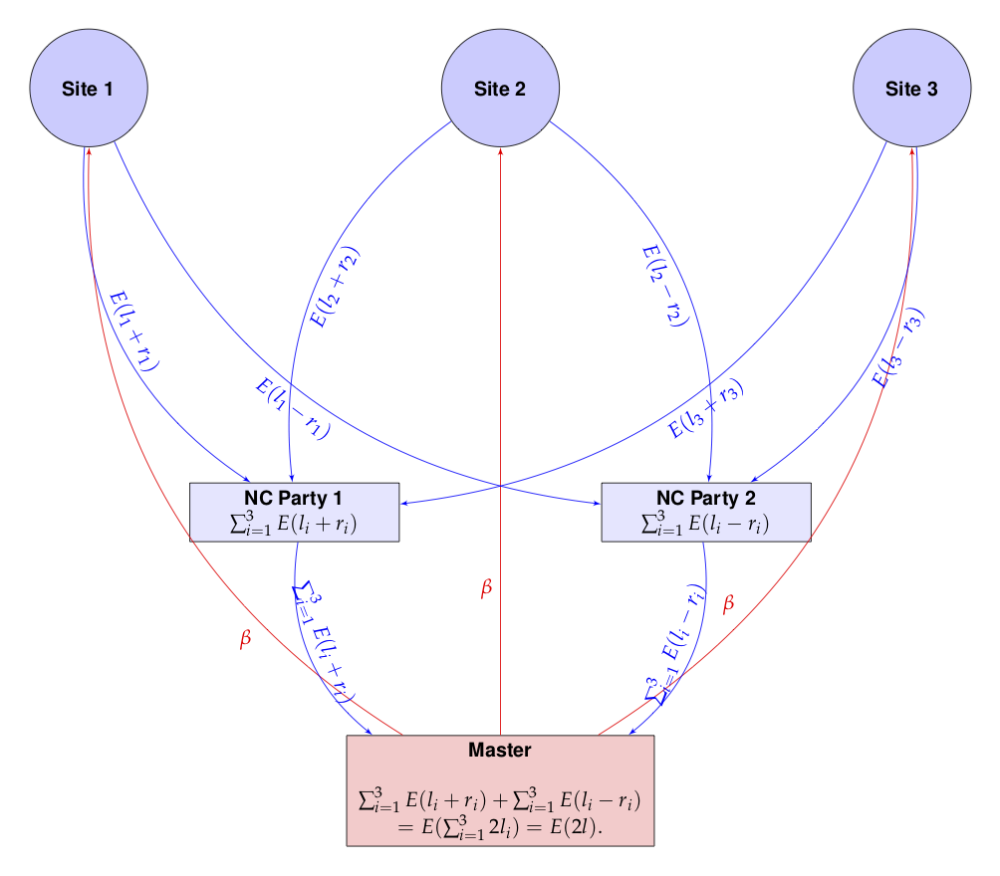
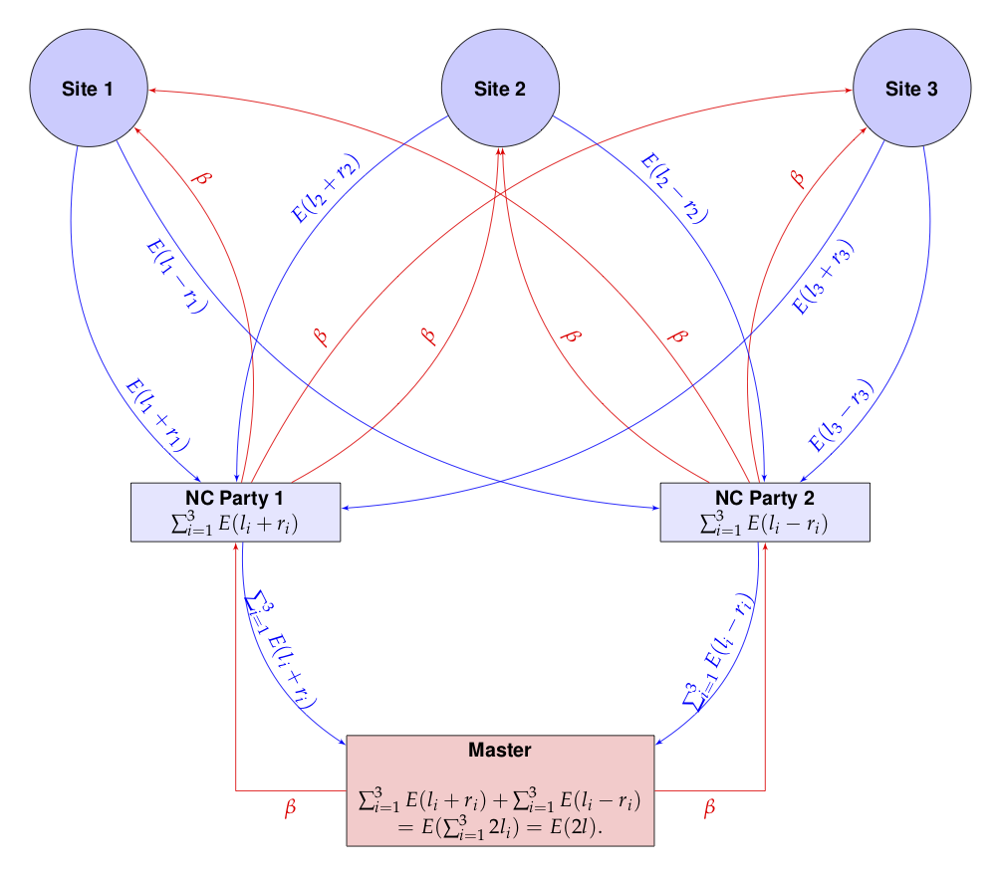

```{r echo=FALSE}
### get knitr just the way we like it

knitr::opts_chunk$set(
  message = FALSE,
  warning = FALSE,
  error = FALSE,
  tidy = FALSE,
  cache = FALSE
)
```

## Introduction

It is only a short way from the toy MLE example to a more useful
example using Cox regression.

But first, we need the `survival` package and the `homomopheR` package.

```{r}
if (!require("survival")) {
    stop("this vignette requires the survival package")
}
library(homomorpheR)
```

We generate some simulated data for the purpose of this example. We
will have three sites each with patient data (sizes 1000, 500 and
1500) respectively, containing

- `sex` (0, 1) for male/female
- `age` between 40 and 70
- a biomarker `bm`
- a `time` to some event of interest
- an indicator `event` which is 1 if an event was observed and 0
otherwise.

It is common to fit stratified models using sites as strata since the
patient characteristics usually differ from site to site. So the
baseline hazards (`lambdaT`) are different for each site but they
share common coefficients (`beta.1`, `beta.2` and `beta.3` for `age`,
`sex` and `bm` respy.) for the model. See [@survival-book] by Therneau
and Grambsch for details. So our model for each site $i$ is

$$
S(t, age, sex, bm) =
[S_0^i(t)]^{\exp(\beta_1 age + \beta_2 sex + \beta_3 bm)}
$$


```{r}
sampleSize <- c(n1 = 1000, n2 = 500, n3 = 1500)

set.seed(12345)

beta.1 <- -.015; beta.2 <- .2; beta.3 <- .001;

lambdaT <- c(5, 4, 3)
lambdaC <- 2

coxData <- lapply(seq_along(sampleSize),
                  function(i) {
                      sex <- sample(c(0, 1), size = sampleSize[i], replace = TRUE)
                      age <- sample(40:70, size = sampleSize[i], replace = TRUE)
                      bm <- rnorm(sampleSize[i])
                      trueTime <- rweibull(sampleSize[i],
                                           shape = 1,
                                           scale = lambdaT[i] * exp(beta.1 * age + beta.2 * sex + beta.3 * bm ))
                      censoringTime <- rweibull(sampleSize[i],
                                                shape = 1,
                                                scale = lambdaC)
                      time <- pmin(trueTime, censoringTime)
                      event <- (time == trueTime)
                      data.frame(stratum = i,
                                 sex = sex,
                                 age = age,
                                 bm = bm,
                                 time = time,
                                 event = event)
                  })
```

So here is a summary of the data for the three sites.

###  Site 1
```{r}
str(coxData[[1]])
```

###  Site 2
```{r}
str(coxData[[2]])
```

###  Site 3
```{r}
str(coxData[[3]])
```

#
# Aggregated fit

If the data were all aggregated in one place, it would very simple to
fit the model. Below, we row-bind the data from the three sites.

```{r}
aggModel <- coxph(formula = Surv(time, event) ~ sex +
                                age + bm + strata(stratum),
                            data = do.call(rbind, coxData))
aggModel
```

Here `age` and `sex` are significant, but `bm` is not. The estimates
$\hat{\beta}$ are `(-0.180, .020, .007)`.

We can also print out the value of the (partial) log-likelihood at the
MLE.

```{r}
aggModel$loglik
```

The first is the value at the parameter value `(0, 0, 0)` and the last
is the value at the MLE.


## Distributed Computation

Assume now that the data `coxData` is distributed between three sites
none of whom want to share actual data among each other or even with a
master computation process. They wish to keep their data secret but
are willing, together, to provide the sum of their local negative
log-likelihoods. They wish to do this in a manner so that the master
process is _unable to associate the contribution to the likelihood from
each site_.

The overall likelihood function $l(\beta)$ for the entire data is the
sum of the likelihoods at each site: $l(\beta) =
l_1(\beta)+l_2(\beta)+l_3(\beta).$ How can this likelihood be computed
while preventing the master from knowing the individual contributions
of each site?

The key to ensuring that each site will not reveal the actual value
$l_i(\beta)$ for any $\beta$ involves the use of two _non-cooperating_
parties, say, NCP1 and NCP2. Site $i$ sends $E(l_i(\beta) + r_i)$ to NCP1
and $E(l_i(\beta) - r_i)$ to NCP2, where $E(x)$ denotes the encrypted
value of $x$ and $r_i$ is a random quantity generated anew for each
site and each $\beta$. NCP1 can compute $\sum_{i=1}^3E(l_i + r_i)$ and
NCP2 can compute $\sum_{i=1}^3E(l_i - r_i)$, but individually, neither
has a handle on $l = \sum_{i=1}^3 l_i$.

The _master_ process can retrieve $\sum_{i=1}^3E(l_i + r_i)$ and
$\sum_{i=1}^3E(l_i - r_i)$ from NCP1 and NCP2 respectively. Each is an
encrypted value of the sum of the likelihood contributions from all
sites, obfuscated by a random term, and hence is random to the
master. However, the master using the associative and homomorphic
properties of $E(.)$, can compute:

\[
\sum_{i=1}^3E(l_i + r_i) +\sum_{i=1}^3E(l_i - r_i) = \sum_{i=1}^3E(l_i
+ r_i + l_i - r_i)  = \sum_{i=1}^3E(2l_i)  = E(2l)
\]

since $l = l_1 + l_2 + l_3$. The master can now decrypt the result and
obtain $2l$!

This is pictorially shown below.



The red arrows show the master proposing a value $\beta$ to each of
the sites, which reply back to NCP1 and NCP2. The master then
retrieves the values from NCP1 and NCP2 and sums them. 

### A Modified Topology

The drawback of the above scheme is that channels of communication
have to be established from each site to the master process and also
to the two non-cooperating parties NCP1 and NCP2. If the number of
participating sites in a computation changes, then both the master and
NCP1 and NCP2 have to be made aware of the change.

It would be simpler if only NCP1 and NCP2 can talk to both the master and
the sites.  Such a situation would arise, for example, when the sites
are all participating in a disease specific registry. The parties NCP1
and NCP2 would probably be set up once and any new site that has to be
onboarded needs only to be known to P1 and P2. This has the added
advantage of hiding the number of sites, which could even be 1!

Such a communication topology would mean that the $\beta$ values have
be funneled to the sites through NCP1 and NCP2 and that can be easily
accomplished.  The picture below shows this configuration and looks
more complicated than it actually is.



To summarize, the modified scheme has several characteristics:

- The master only communicates with NCP1 and NCP2
- NCP1 and NCP2 are the only parties communicating with both the
  master and sites
- NCP1 and NCP2 are the only ones that know how many sites are
  participating
- New sites can be added and only NCP1 and NCP2 need to account for
  them while the master remains oblivous to the number of sites; so
  _the scheme works even with one site_
- It appears that there is unnecessary communication of the same
  information, i.e. $\beta$ is being sent twice to each site from each
  of the NCP1 and NCP2. This is easily mitigated by engineering either
  by using a broker between NCP1 and NCP2, or the sites caching their
  results for a short period to avoid recomputation.

## Implementation

The above implementation assumes that the encryption and decryption
can happen with real numbers which is not the actual
situation. Instead, we use rational approximations using a large
denominator, $2^{256}$, say. In the future, of course, we need to
build an actual library is built with rigorous algorithms guaranteeing
precision and overflow/undeflow detection. For now, this is just an ad
hoc implementation.

Also, since we are only using homomorphic additive properties, a
partial homomorphic scheme such as the Paillier Encryption system will
be sufficient for our computations.

We define classes to encapsulate our sites, non-cooperating parties
and a master process. 

### The Site Class

Our site class will compute the partial log likelihood on site data
given a parameter $\beta$. Note how the private `nll` method takes
care to split the result into an integer and fractional part while
performing the arithmetic operations. (The latter is approximated by a
rational number.)

In the code below, we exploit a feature of `coxph`: a control
parameter can be passed to evaluate the partial likelihood at a given
$\beta$ value. We also use a cache so that we can distribute each
piece of the encrypted likelihood $E(l_i - r_i)$ and $E(l_i + r_i)$ to
the two non-cooperating parties.

```{r}
Site <-
    R6::R6Class(
            "Site",
            private = list(
                ## name of the site
                name = NA,
                ## local data
                data = NA,
                ## Control variable for cox regression
                cph.control = NA,
                beta_cache = list(),
                local_nll = function(beta) {
                    ## Check if value is cached
                    beta_hash  <- paste0("b", digest::digest(beta, algo = "xxhash64"))
                    result  <- private$beta_cache[[beta_hash]]
                    if (is.null(result)) {
                        ## We're worker, so compute local negative log likelihood
                        nllValue  <- tryCatch({
                            m <- coxph(formula = Surv(time, event) ~ sex + age + bm,
                                       data = private$data,
                                       init = beta,
                                       control = private$cph.control)
                            -(m$loglik[1])
                        },
                        error = function(e) NA)
                        if (!is.na(nllValue)) {
                            pubkey <- self$pubkey
                            ## Generate random offset for int and frac parts
                            offset <- list(int = random.bigz(nBits = 256),
                                           frac = random.bigz(nBits = 256))
                            ## 2. Add to neg log likelihood
                            result.int <- floor(nllValue)
                            result.frac <- nllValue - result.int
                            ## Approximate fractional part by a rational
                            result.fracnum <- gmp::as.bigz(gmp::numerator(gmp::as.bigq(result.frac) * self$den))
                            result  <- list(
                                int1 = pubkey$encrypt(result.int - offset$int),
                                frac1 = pubkey$encrypt(result.fracnum - offset$frac),
                                int2 = pubkey$encrypt(result.int + offset$int),
                                frac2 = pubkey$encrypt(result.fracnum + offset$frac)
                            )
                            private$beta_cache[[beta_hash]]  <- result
                        } else {
                            result  <- list(int1 = NA, frac1 = NA, int2 = NA, frac2 = NA)
                        }
                    }
                    result
                }
            ),
            public = list(
                count = NA,
                ## Common denominator for approximate real arithmetic
                den = NA,
                ## The master's public key; everyone has this
                pubkey = NA,
                initialize = function(name, data) {
                    private$name <- name
                    private$data <- data
                    private$cph.control <- replace(coxph.control(), "iter.max", 0)
                },
                setPublicKey = function(pubkey) {
                    self$pubkey <- pubkey
                },
                setDenominator = function(den) {
                    self$den = den
                },
                ## neg log lik,
                nll = function(beta, party) {
                    result  <- private$local_nll(beta)
                    if (party == 1) {
                        list(int = result$int1, frac = result$frac1)
                    } else {
                        list(int = result$int2, frac = result$frac2)
                    }
                }
            )
        )

```

### The Non-cooperating Parties Class

The non-cooperating parties can communicate with the sites. So they
have methods for adding sites, passing on public keys from the master
etc. The `nll` method for this class merely calls each site to compute
the result and adds them up before sending it on to the master, so
that the master has no idea of the individual contributions.

```{r}
NCParty <-
    R6::R6Class(
            "NCParty",
            private = list(
                ## name of the site
                name = NA,
                ## NC party number
                number = NA,
                ## The master
                master = NA,
                ## The sites
                sites = list()
            ),
            public = list(
                ## The master's public key; everyone has this
                pubkey = NA,
                ## The denoinator for rational arithmetic
                den = NA,
                initialize = function(name, number) {
                    private$name <- name
                    private$number  <- number
                },
                setPublicKey = function(pubkey) {
                    self$pubkey <- pubkey
                    ## Propagate to sites
                    for (site in sites) {
                        site$setPublicKey(pubkey)
                    }
                },
                setDenominator = function(den) {
                    self$den <- den
                    ## Propagate to sites
                    for (site in sites) {
                        site$setDenominator(den)
                    }
                },
                addSite = function(site) {
                    private$sites  <- c(private$sites, list(site))
                },
                ## neg log lik
                nll = function(beta) {
                    pubkey  <- self$pubkey
                    results  <- lapply(sites, function(x) x$nll(beta, private$number))
                    ## Accumulate the integer and fractional parts
                    n  <- length(results)
                    sumInt  <- results[[1L]]$int
                    sumFrac <- results[[1L]]$frac
                    for (i in 2:n) {
                        sumInt  <- pubkey$add(sumInt, results[[i]]$int)
                        sumFrac  <- pubkey$add(sumFrac, results[[i]]$frac)
                    }
                    list(int = sumInt, frac = sumFrac)
                }
            )
        )

```

### The Master Class

The master process 

```{r}
Master  <-
    R6::R6Class(
            "Master",
            private = list(
                ## name of the site
                name = NA,
                ## Private and public keys
                keys = NA,
                ## Non cooperating party 1
                nc_party_1 = NA,
                ## Non cooperating party 2
                nc_party_2 = NA
            ),
            public = list(
                ## Denominator for rational arithmetic
                den  = NA,
                initialize = function(name) {
                    private$name <- name
                    private$keys <- PaillierKeyPair$new(1024) ## Generate new public and private key.
                    self$den <- gmp::as.bigq(2)^256  #Our denominator for rational approximations
                },
                setNCParty1  = function(site) {
                    private$nc_party_1 <- site
                    private$nc_party_1$setPublicKey(private$keys$pubkey)
                    private$nc_party_1$setDenominator(self$den)
                },
                setNCParty2  = function(site) {
                    private$nc_party_2 <- site
                    private$nc_party_2$setPublicKey(private$keys$pubkey)
                    private$nc_party_2$setDenominator(self$den)
                },
                ## neg log lik
                nLL = function(beta) {
                    pubkey  <- private$keys$pubkey
                    privkey  <- private$keys$getPrivateKey()
                    result1  <- private$nc_party_1$nll(beta)
                    result2  <- private$nc_party_2$nll(beta)
                    ## Accumulate the integer and fractional parts
                    sumInt  <- pubkey$add(result1$int, result2$int)
                    sumFrac  <- pubkey$add(result1$frac, result2$frac)
                    intResult <- as.double(privkey$decrypt(sumInt))
                    fracResult <- as.double(gmp::as.bigq(privkey$decrypt(sumFrac)) / self$den)
                    ## Since we 2L, we divide by 2.
                    (intResult + fracResult) / 2.0
                }
            )
        )
```

## Example

We are now ready to use our sites in the computation.

### 1. Create sites

```{r}
site1 <- Site$new(name = "Site 1", data = coxData[[1]])
site2 <- Site$new(name = "Site 2", data = coxData[[2]])
site3 <- Site$new(name = "Site 3", data = coxData[[3]])

sites  <- list(site1 = site1, site2 = site2, site3 = site3)
```

### 2. Create Non-cooperating parties

```{r}
ncp1  <- NCParty$new("NCP1", 1)
ncp2  <- NCParty$new("NCP1", 2)

```

We add sites to the non-cooperating parties.

```{r}
for (s in sites) {
    ncp1$addSite(s)
    ncp2$addSite(s)
}
```

### 3. Create the master process

```{r}
master  <- Master$new("Master")
```

We next connect the master to the non-cooperating parties.

```{r}
master$setNCParty1(ncp1)
master$setNCParty2(ncp2)

```

At this point the communication graph has been defined between the
master and non-cooperating parties and the non-cooperating parties and
the sites. 

### 4. Perform the likelihood estimation

```{r}
library(stats4)
nll <- function(age, sex, bm) master$nLL(c(age, sex, bm))
fit <- mle(nll, start = list(age = 0, sex = 0, bm = 0))
```

### 5. Compare the results

The summary will show the results.

```{r}
summary(fit)
```

Note how the estimated coefficients and standard errors closely match
the full model summary below.

```{r}
summary(aggModel)
```

And the log likelihood of the distributed homomorphic fit also
matches that of the aggregated model as the following computation shows.

```{r}
cat(sprintf("logLik(MLE fit): %f, logLik(Agg. fit): %f\n", logLik(fit), aggModel$loglik[2]))
```

## References
