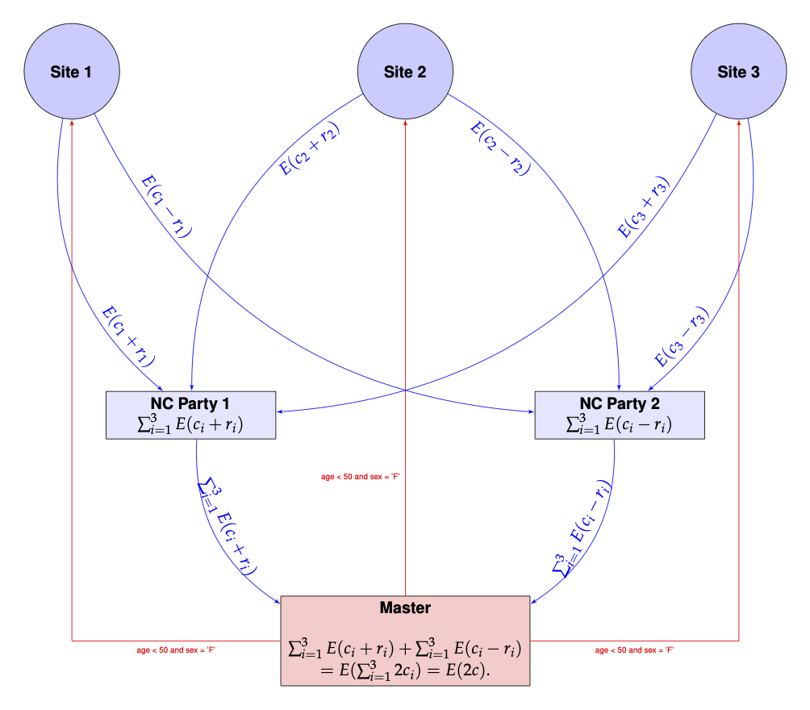
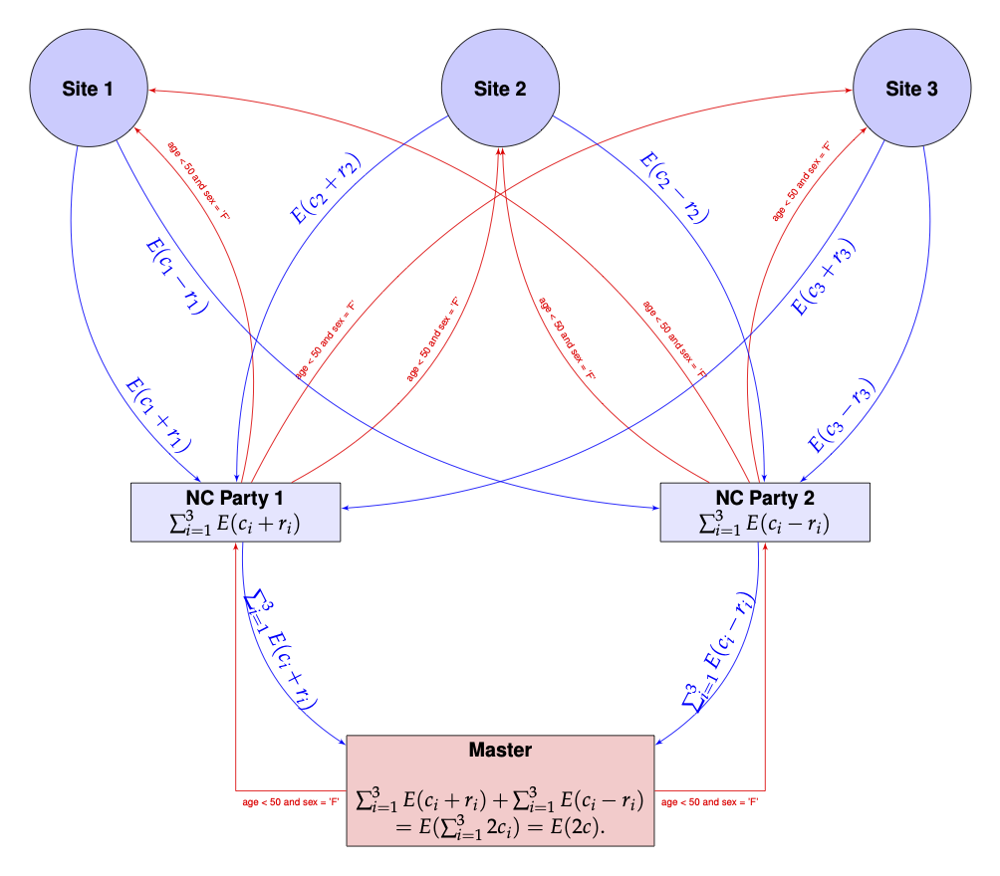

```{r echo=FALSE, message = FALSE}
### get knitr just the way we like it

knitr::opts_chunk$set(
  message = FALSE,
  warning = FALSE,
  error = FALSE,
  tidy = FALSE,
  cache = FALSE
  )
library(homomorpheR)
if (!require("magrittr", quietly = TRUE)) stop("This vignette requires the magrittr package!")
if (!require("dplyr", quietly = TRUE)) stop("This vignette requires the dplyr package!")
                                                       
```


## Introduction

We demonstrate the use of non-cooperating parties to run a distributed
query count computation using the `homomorpheR` package a simulated
data set containing:

- `sex` (F, M) for female/male
- `age` between 40 and 70
- `bm` a biomarker


```{r}
set.seed(130)
sample_size  <- c(60, 15, 25)
query_data  <- local({
    tmp  <- c(0, cumsum(sample_size))
    start  <- tmp[1:3] + 1
    end  <- tmp[-1]
    id_list  <- Map(seq, from = start, to = end)
    lapply(seq_along(sample_size),
           function(i) {
               id  <- sprintf("P%4d", id_list[[i]])
               sex <- sample(c("F", "M"), size = sample_size[i], replace = TRUE)
               age <- sample(40:70, size = sample_size[i], replace = TRUE)
               bm <- rnorm(sample_size[i])
               data.frame(id = id, sex = sex, age = age, bm = bm, stringsAsFactors = FALSE)
           })
})

```

###  Site 1
```{r}
str(query_data[[1]])
```

###  Site 2
```{r}
str(query_data[[2]])
```

###  Site 3
```{r}
str(query_data[[3]])
```

## Aggregated Query

If the data were all aggregated in one place, it would very simple to
query it. Let us run a sample query on this aggregated data set for
the condition `age < 50 & sex == 'F' & bm < 0.2`

```{r}
do.call(rbind, query_data) %>%
    filter(age < 50 & sex == 'F' & bm < 0.2) %>%
    nrow()
```

## Distributed Computation

Assume now that the data `query_data` is distributed between three
sites none of whom want to share actual data among each other or even
with a master computation process. They wish to keep their data secret
but are willing, together, to provide the sum of the total count. They
wish to do this in a manner so that the master process is _unable to
associate the contribution to the likelihood from each site_.

The overall query count for for the entire data is the sum of the
counts at each site. How can this count be computed while preventing
the master from knowing the individual contributions of each site?

We will use two _non-cooperating parties_, say NCP1 and NCP2, to
accomplish this. These parties do not talk to each other, but do talk
to the sites and the master process. Site $i$ sends $E(c_i + r_i)$ to
NCP1 and $E(c_i - r_i)$ to NCP2, where $c_i$ is the actual count,
$E(c_i)$ denotes the encrypted value of $c_i$ and $r_i$ is a random
quantity generated anew for each site. NCP1 can compute
$\sum_{i=1}^3E(c_i + r_i)$ and NCP2 can compute $\sum_{i=1}^3E(c_i -
r_i)$, but individually, neither has a handle on $l = \sum_{i=1}^3
c_i$.

The _master_ process can retrieve $\sum_{i=1}^3E(c_i + r_i)$ and
$\sum_{i=1}^3E(c_i - r_i)$ from NCP1 and NCP2 respectively. Each is an
encrypted value of the sum of counts from all sites, obfuscated by
random terms, and hence is random to the master. However, the master
using the associative and homomorphic properties of $E(.)$, can
compute:

\[
\sum_{i=1}^3E(c_i + r_i) +\sum_{i=1}^3E(c_i - r_i) = \sum_{i=1}^3E(c_i
+ r_i + c_i - r_i)  = \sum_{i=1}^3E(2c_i)  = E(2c)
\]

since $c = c_1 + c_2 + c_3$ is the grant total count. The master can
now decrypt the result and obtain $c$!

This is pictorially shown below.



The red arrows show the master proposing a value $\beta$ to each of
the sites, which reply back to NCP1 and NCP2. The master then
retrieves the values from NCP1 and NCP2 and sums them. 

### A Modified Topology

The drawback of the above scheme is that channels of communication
have to be established from each site to the master process and also
to the two non-cooperating parties NCP1 and NCP2. If the number of
participating sites in a computation changes, then both the master and
NCP1 and NCP2 have to be made aware of the change.

It would be simpler if only NCP1 and NCP2 can talk to both the master and
the sites.  Such a situation would arise, for example, when the sites
are all participating in a disease specific registry. The parties NCP1
and NCP2 would probably be set up once and any new site that has to be
onboarded needs only to be known to P1 and P2. This has the added
advantage of hiding the number of sites, which could even be 1!

Such a communication topology would mean that the $\beta$ values have
be funneled to the sites through NCP1 and NCP2 and that can be easily
accomplished.  The picture below shows this configuration and looks
more complicated than it actually is.



To summarize, the modified scheme has several characteristics:

- The master only communicates with NCP1 and NCP2
- NCP1 and NCP2 are the only parties communicating with both the
  master and sites
- NCP1 and NCP2 are the only ones that know how many sites are
  participating
- New sites can be added and only NCP1 and NCP2 need to account for
  them while the master remains oblivous to the number of sites; so
  _the scheme works even with one site_
- It appears that there is unnecessary communication of the same
  information, i.e. $\beta$ is being sent twice to each site from each
  of the NCP1 and NCP2. This is easily mitigated by engineering either
  by using a broker between NCP1 and NCP2, or the sites caching their
  results for a short period to avoid recomputation.

## Implementation

The above implementation assumes that the encryption and decryption
can happen with real numbers which is not the actual
situation. Instead, we use rational approximations using a large
denominator, $2^{256}$, say. In the future, of course, we need to
build an actual library is built with rigorous algorithms guaranteeing
precision and overflow/undeflow detection. For now, this is just an ad
hoc implementation.

Also, since we are only using homomorphic additive properties, a
partial homomorphic scheme such as the Paillier Encryption system will
be sufficient for our computations.

We define classes to encapsulate our sites, non-cooperating parties
and a master process. 

### The Site Class

Our site class will compute the count on site data.

```{r}
Site <-
    R6::R6Class(
            "Site",
            private = list(
                ## name of the site
                name = NA,
                ## local data
                data = NA,
                result_cache = NULL,
                filterCondition = NA,
                local_query_count = function() {
                    ## Check if value is cached
                    result  <- private$result_cache
                    if (is.null(result)) {
                        ## We need to run the query
                        pubkey <- self$pubkey
                        ## Generate random offset for int and frac parts
                        offset.int <- random.bigz(nBits = 256)
                        ## 2. Add to count
                        data  <- private$data
                        filter_expr  <- eval(parse(text = paste("rlang::expr(", private$filterCondition, ")")))
                        data %>%
                            dplyr::filter(!! filter_expr) %>%
                            nrow() ->
                            result.int
                        result  <- list(
                            int1 = pubkey$encrypt(result.int - offset.int),
                            int2 = pubkey$encrypt(result.int + offset.int)
                        )
                        private$result_cache  <- result
                    }
                    result
                }
            ),
            public = list(
                ## Common denominator for approximate real arithmetic
                den = NA,
                ## The master's public key; everyone has this
                pubkey = NA,
                initialize = function(name, data) {
                    private$name <- name
                    private$data <- data
                },
                setPublicKey = function(pubkey) {
                    self$pubkey <- pubkey
                },
                setDenominator = function(den) {
                    self$den = den
                },
                setFilterCondition = function (filterCondition) {
                    private$filterCondition  <- filterCondition
                },
                ## query count,
                query_count = function(party) {
                    result  <- private$local_query_count()
                    if (party == 1) result$int1 else result$int2
                }
            )
        )

```

### The Non-cooperating Parties Class

The non-cooperating parties can communicate with the sites. So they
have methods for adding sites, passing on public keys from the master
etc. The `query_count` method for this class merely calls each site to compute
the result and adds them up before sending it on to the master, so
that the master has no idea of the individual contributions.

```{r}

NCParty <-
    R6::R6Class(
            "NCParty",
            private = list(
                ## name of the site
                name = NA,
                ## NC party number
                number = NA,
                ## filter condition
                filterCondition = NA,
                ## The master
                master = NA,
                ## The sites
                sites = list()
            ),
            public = list(
                ## The master's public key; everyone has this
                pubkey = NA,
                ## The denoinator for rational arithmetic
                den = NA,
                initialize = function(name, number) {
                    private$name <- name
                    private$number  <- number
                },
                setPublicKey = function(pubkey) {
                    self$pubkey <- pubkey
                    ## Propagate to sites
                    for (site in sites) {
                        site$setPublicKey(pubkey)
                    }
                },
                setDenominator = function(den) {
                    self$den <- den
                    ## Propagate to sites
                    for (site in sites) {
                        site$setDenominator(den)
                    }
                },
                setFilterCondition = function(filterCondition) {
                    private$filterCondition  <- filterCondition
                    ## Propagate to sites
                    for (site in sites) {
                        site$setFilterCondition(filterCondition)
                    }
                },
                addSite = function(site) {
                    private$sites  <- c(private$sites, list(site))
                },
                ## sum of all counts
                query_count = function() {
                    pubkey  <- self$pubkey
                    results  <- lapply(sites, function(x) x$query_count(private$number))
                    ## Accumulate the integer and fractional parts
                    n  <- length(results)
                    enc_sum <- pubkey$encrypt(0)
                    for (result in results) {
                        enc_sum  <- pubkey$add(enc_sum, result)
                    }
                    enc_sum
                }
            )
        )

```

### The Master Class

The master process 

```{r}
Master  <-
    R6::R6Class(
            "Master",
            private = list(
                ## name of the site
                name = NA,
                ## Private and public keys
                keys = NA,
                ## Non cooperating party 1
                nc_party_1 = NA,
                ## Non cooperating party 2
                nc_party_2 = NA,
                ## filter condition
                filterCondition = NA
            ),
            public = list(
                ## Denominator for rational arithmetic
                den  = NA,
                initialize = function(name, filterCondition) {
                    private$name <- name
                    private$keys <- PaillierKeyPair$new(1024) ## Generate new public and private key.
                    self$den <- gmp::as.bigq(2)^256  #Our denominator for rational approximations
                    private$filterCondition  <- filterCondition
                },
                setNCParty1  = function(site) {
                    private$nc_party_1 <- site
                    private$nc_party_1$setPublicKey(private$keys$pubkey)
                    private$nc_party_1$setDenominator(self$den)
                    private$nc_party_1$setFilterCondition(private$filterCondition)
                },
                setNCParty2  = function(site) {
                    private$nc_party_2 <- site
                    private$nc_party_2$setPublicKey(private$keys$pubkey)
                    private$nc_party_2$setDenominator(self$den)
                    private$nc_party_2$setFilterCondition(private$filterCondition)
                },
                ## Query count
                query_count = function() {
                    pubkey  <- private$keys$pubkey
                    privkey  <- private$keys$getPrivateKey()
                    result1  <- private$nc_party_1$query_count()
                    result2  <- private$nc_party_2$query_count()
                    ## Sum it
                    enc_sum <- pubkey$add(result1, result2)
                    final_result <- as.integer(privkey$decrypt(enc_sum))
                    ## Since we 2c, we divide by 2.
                    final_result / 2
                }
            )
        )

```

## Example

We are now ready to use our sites in the computation.

### 1. Create sites

```{r}
site1 <- Site$new(name = "Site 1", data = query_data[[1]])
site2 <- Site$new(name = "Site 2", data = query_data[[2]])
site3 <- Site$new(name = "Site 3", data = query_data[[3]])

sites  <- list(site1 = site1, site2 = site2, site3 = site3)
```

### 2. Create Non-cooperating parties

```{r}
ncp1  <- NCParty$new("NCP1", 1)
ncp2  <- NCParty$new("NCP1", 2)

```

We add sites to the non-cooperating parties.

```{r}
for (s in sites) {
    ncp1$addSite(s)
    ncp2$addSite(s)
}
```

### 3. Create the master process

```{r}
master  <- Master$new(name = "Master",
                      filterCondition = "age < 50 & sex == 'F' & bm < 0.2")
```

We next connect the master to the non-cooperating parties.

```{r}
master$setNCParty1(ncp1)
master$setNCParty2(ncp2)

```

At this point the communication graph has been defined between the
master and non-cooperating parties and the non-cooperating parties and
the sites. 

### 4. Perform the Query

```{r}
cat(sprintf("Query Count is %d\n", master$query_count()))
```

## References
