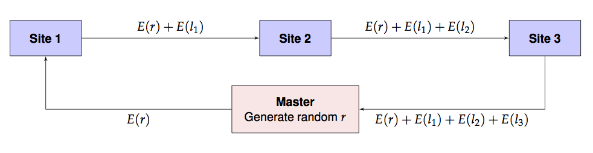

```{r echo=F}
### get knitr just the way we like it

knitr::opts_chunk$set(
  message = FALSE,
  warning = FALSE,
  error = FALSE,
  tidy = FALSE,
  cache = FALSE
)
```

## Introduction

We present a toy example of a homomorphic computation involving
maximum likelihood estimation.

Consider the following data motivated by an example from the `mle`
function in the `stats4` R package: we wish to estimate $\lambda$, the
Poisson parameter $\lambda$ for randomly generated count data `y` below:

```{r}
library(stats4)
set.seed(17822)
y <- rpois(n = 40, lambda=10)
# Easy one-dimensional MLE:
nLL <- function(lambda) -sum(stats::dpois(y, lambda, log = TRUE))
fit0 <- mle(nLL, start = list(lambda = 5), nobs = NROW(y))
```

The function `nLL` is the negative log-likelihood of the data and the
function `mle` computes the maximum likelihood estimate that can be
printed out.

```{r}
summary(fit0)
```

```{r}
logLik(fit0)
```

## Distributed Computation

Assume now that the data `y` is distributed between three sites, none
of whom want to share actual data among each other or even with a
master computation process. They wish to keep their data secret but
are willing, together, to provide the sum of their local negative
log-likelihoods. They need to do this in a way so that the master
process will not be able to associate the contribution to the
likelihood from each site. To simulate this, let's partition the data
`y` as follows.

```{r}
y1 <- y[1:20]
y2 <- y[21:27]
y3 <- y[28:40]
```

The overall likelihood function $l(\lambda)$ for the entire data is
therefore the sum of the likelihoods at each site: $l(\lambda) =
l_1(\lambda)+l_2(\lambda)+l_3(\lambda).$ How can this likelihood be
computed while maintaining privacy?

Assuming that every site including the master has access to a
homomorphic computation library such as `homomorpheR`, the likelihood
can be computed in a privacy-preserving manner using the following
scheme. We use $E(x)$ and $D(x)$ to denote the encrypted and decrypted
values of $x$ respectively.

0. Master generates a public/private key pair. Master distributes the
   public key to all sites. (The private key is not distributed and
   kept only by the master.)
1. Master generates a random offset $r$ to obfuscate the intial
   likelihood.
2. Master sends $E(r)$ and a guess $\lambda_0$ to site 1. Note that
   $\lambda$ is not encrypted.
3. Site 1 computes $l_1 = l(\lambda_0, y_1)$, the local likelihood for
   local data $y_1$ using parameter $\lambda_0$. It then sends on
   $\lambda_0$ and $E(r) + E(l_1)$ to site 2.
4. Site 2 computes $l_2 = l(\lambda_0, y_2)$, the local likelihood for
   local data $y_2$ using parameter $\lambda_0$. It then sends on
   $\lambda_0$ and $E(r) + E(l_1) + E(l_2)$ to site 3.
5. Site 3 computes $l_3 = l(\lambda_0, y_3)$, the local likelihood for
   local data $y_3$ using parameter $\lambda_0$. It then sends on
   $E(r) + E(l_1) + E(l_2) + E(l_3)$ back to master.
6. Master retrieves $E(r) + E(l_1) + E(l_2) + E(l_3)$ which, due to
   the homomorphism, is exactly $E(r+l_1+l_2+l_3) = E(r+l).$ So the
   master computes $D(E(r+l)) - r$ to obtain the value of the overall
   likelihood at $\lambda_0$.
7. Master updates $\lambda_0$ with a new guess $\lambda_1$ and repeats
   steps 1-5. This process is iterated to convergence. For added
   security, even steps 0-5 can be repeated, at additional
   computational cost.

This is pictorially shown below.




## Implementation

The above implementation assumes that the encryption and decryption
can happen with real numbers which is not the actual
situation. Instead, we use rational approximations using a large
denominator, $2^{256}$, say. In the future, of course, we need to
build an actual library is built with rigorous algorithms guaranteeing
precision and overflow/undeflow detection. For now, this is just an ad
hoc implementation.

Also, since we are only using homomorphic additive properties, a
partial homomorphic scheme such as the Paillier Encryption system will
be sufficient for our computations.

We define a class to encapsulate our sites that will compute the
Poisson likelihood on site data given a parameter $\lambda$. Note how
the `addNLLAndForward` method takes care to split the result into an
integer and fractional part while performing the arithmetic
operations. (The latter is approximated by a rational number.)

```{r}
library(gmp)
library(homomorpheR)
Site <- R6::R6Class("Site",
                    private = list(
                        ## name of the site
                        name = NA,
                        ## only master has this, NA for workers
                        privkey = NA,
                        ## local data
                        data = NA,
                        ## The next site in the communication: NA for master
                        nextSite = NA,
                        ## is this the master site?
                        iAmMaster = FALSE,
                        ## intermediate result variable
                        intermediateResult = NA
                    ),
                    public = list(
                        ## Common denominator for approximate real arithmetic
                        den = NA,
                        ## The public key; everyone has this
                        pubkey = NA,
                        initialize = function(name, data, den) {
                            private$name <- name
                            private$data <- data
                            self$den <- den
                        },
                        setPublicKey = function(pubkey) {
                            self$pubkey <- pubkey
                        },
                        setPrivateKey = function(privkey) {
                            private$privkey <- privkey
                        },
                        ## Make me master
                        makeMeMaster = function() {
                            private$iAmMaster <- TRUE
                        },
                        ## add neg log lik and forward to next site
                        addNLLAndForward = function(lambda, enc.offset) {
                            if (private$iAmMaster) {
                                ## We are master, so don't forward
                                ## Just store intermediate result and return
                                private$intermediateResult <- enc.offset
                            } else {
                                ## We are workers, so add and forward
                                ## add negative log likelihood and forward result to next site
                                ## Note that offset is encrypted
                                nllValue <- self$nLL(lambda)
                                result.int <- floor(nllValue)
                                result.frac <- nllValue - result.int
                                result.fracnum <- as.bigq(numerator(as.bigq(result.frac) * self$den))
                                pubkey <- self$pubkey
                                enc.result.int <- pubkey$encrypt(result.int)
                                enc.result.fracnum <- pubkey$encrypt(result.fracnum)
                                result <- list(int = pubkey$add(enc.result.int, enc.offset$int),
                                               frac = pubkey$add(enc.result.fracnum, enc.offset$frac))
                                private$nextSite$addNLLAndForward(lambda, enc.offset = result)
                            }
                            ## Return a TRUE result for now.
                            TRUE
                        },
                        ## Set the next site in the communication graph
                        setNextSite = function(nextSite) {
                            private$nextSite <- nextSite
                        },
                        ## The negative log likelihood
                        nLL = function(lambda) {
                            if (private$iAmMaster) {
                                ## We're master, so need to get result from sites
                                ## 1. Generate a random offset and encrypt it
                                pubkey <- self$pubkey
                                offset <- list(int = random.bigz(nBits = 256),
                                               frac = random.bigz(nBits = 256))
                                enc.offset <- list(int = pubkey$encrypt(offset$int),
                                                   frac = pubkey$encrypt(offset$frac))
                                ## 2. Send off to next site
                                throwaway <- private$nextSite$addNLLAndForward(lambda, enc.offset)
                                ## 3. When the call returns, the result will be in
                                ##    the field intermediateResult, so decrypt that.
                                sum <- private$intermediateResult
                                privkey <- private$privkey
                                intResult <- as.double(privkey$decrypt(sum$int) - offset$int)
                                fracResult <- as.double(as.bigq(privkey$decrypt(sum$frac) - offset$frac) / den)
                                intResult + fracResult
                            } else {
                                ## We're worker, so compute local nLL
                                -sum(stats::dpois(private$data, lambda, log = TRUE))
                            }
                        })
                    )
```

We are now ready to use our sites in the computation.

### 1. Generate public and private key pair

We also choose a denominator for all our rational approximations.

```{r}
keys <- PaillierKeyPair$new(1024) ## Generate new public and private key.
den <- gmp::as.bigq(2)^256  #Our denominator for rational approximations
```

### 2. Create sites

```{r}
site1 <- Site$new(name = "Site 1", data = y1, den = den)
site2 <- Site$new(name = "Site 2", data = y2, den = den)
site3 <- Site$new(name = "Site 3", data = y3, den = den)
```
The master process is also a site but has no data. So has to be thus
designated.

```{r}
## Master has no data!
master <- Site$new(name = "Master", data = c(), den = den)
master$makeMeMaster()
```

### 2. Distribute public key to sites


```{r}
site1$setPublicKey(keys$pubkey)
site2$setPublicKey(keys$pubkey)
site3$setPublicKey(keys$pubkey)
master$setPublicKey(keys$pubkey)
```

Only master has private key for decryption.

```{r}
master$setPrivateKey(keys$getPrivateKey())
```


### 3. Define the communication graph

Master will always send to the first site, and then the others have to
forward results in turn with the last site returning to the master.

```{r}
master$setNextSite(site1)
site1$setNextSite(site2)
site2$setNextSite(site3)
site3$setNextSite(master)
```

### 4. Perform the likelihood estimation


```{r}
fit1 <- mle(master$nLL, start = list(lambda = 5))
```


Print the summary.

```{r}
summary(fit1)
```

```{r}
logLik(fit1)
```

The results should be the same as above.

## Applications via `distcomp` and `opencpu`

One can imagine these sort of computations being constructed within
the framework described the R package
[distcomp](https://cran.r-project.org/package=distcomp) where the sites are
[opencpu](https://opencpu.org) servers and there is a master process executing the
computation. Much work remains to be done to make this work in a
seamless manner; however, as this proof-of-concept example shows, the
technical hurdles are quite surmountable.

## CAVEAT

This is an initial proof-of-concept implementation that has to
substantially improved for real-world use. You've been warned.


